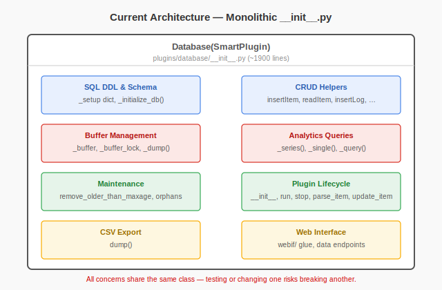
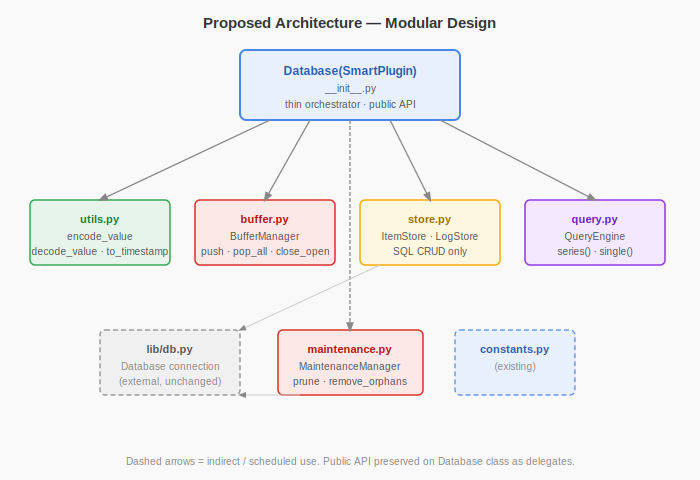
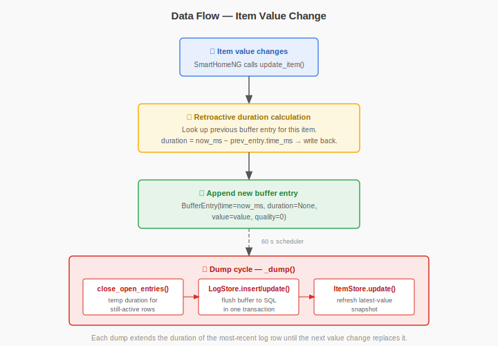
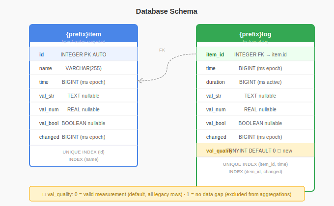
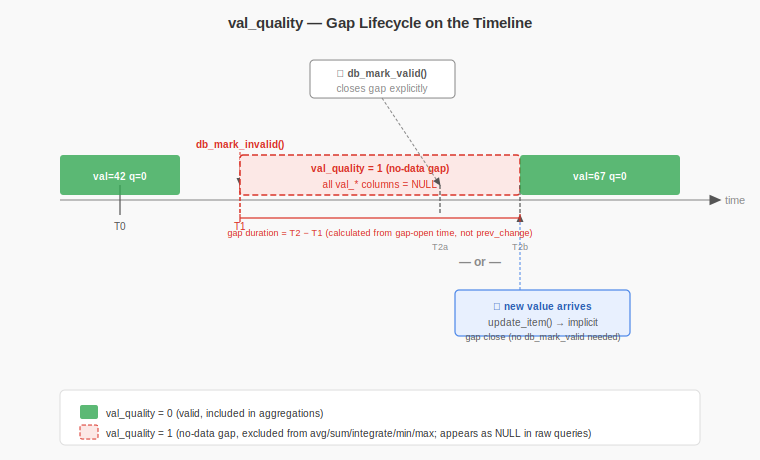

# SmartHomeNG Database Plugin — Developer Documentation

This document describes the internal design of the `database` plugin, the planned refactoring, and the associated bug fixes and improvements. It is aimed at Python developers who are already familiar with SmartHomeNG basics.

---

## 1. Overview

The `database` plugin persists item values to a relational database (SQLite, MySQL, or PostgreSQL via `lib/db.py`). Its distinguishing feature compared to a plain event log is that **every row records not just a value but how long that value was active** — the `duration` column. This makes it straightforward to compute time-weighted averages, cumulative energy totals, and similar analytics directly in SQL.

Four concepts are central to understanding the plugin:

| Concept | Description |
|---|---|
| **log table** | The historical record. One row per value-change event, with `time`, `duration`, and the value itself. |
| **item table** | A single-row-per-item snapshot of the *latest* value. Used for fast lookups without scanning the log. |
| **buffer** | An in-memory dict (keyed by item id) that accumulates incoming changes between database writes. |
| **dump cycle** | A scheduler job that runs every 60 seconds and flushes the buffer to SQL in a single transaction. |

---

## 2. Current Architecture (Before Refactoring)

The entire plugin is implemented as a single file:

```
plugins/database/__init__.py   (1 891 lines)
```

Everything lives inside the `Database(SmartPlugin)` class:

- SQL DDL and schema setup (`_setup` dict, `_initialize_db`)
- Low-level CRUD helpers (`insertItem`, `updateItem`, `readItem`, `insertLog`, `updateLog`, `readLog`, …)
- Buffer management (`_buffer`, `_buffer_lock`, `_dump`)
- Analytics queries (`_series`, `_single`, the `_query` dispatcher)
- Maintenance tasks (`remove_older_than_maxage`, `_remove_orphans`)
- Plugin lifecycle (`__init__`, `run`, `stop`, `parse_item`, `update_item`)
- CSV export (`dump`)
- Web interface glue



The consequence of this monolithic design is tight coupling: a one-line change to buffering logic requires touching the same file as a SQL schema migration. Testing any single concern requires instantiating the full `SmartPlugin` stack. Bug fixes in one area risk inadvertently breaking another.

---

## 3. Proposed Architecture

The refactoring extracts each concern into its own module. The public API — all method names currently called by items, the web interface, and user automations — is preserved on the `Database` class as thin delegates, ensuring **full backward compatibility**.

```
plugins/database/
├── __init__.py        # Database(SmartPlugin) — thin orchestrator, public API
├── utils.py           # Pure functions, no side-effects
├── buffer.py          # BufferManager — owns buffer dict + lock
├── store.py           # ItemStore + LogStore — SQL CRUD
├── query.py           # QueryEngine — analytics (_series, _single)
├── maintenance.py     # MaintenanceManager — pruning, orphan removal
├── constants.py       # (existing)
└── webif/             # (existing)
```

### Module responsibilities

**`utils.py`** — pure functions only, importable without any database connection:

- `encode_value(value, type_) -> (val_str, val_num, val_bool)` — maps a Python value to the three SQL columns.
- `decode_value(val_str, val_num, val_bool, type_) -> value` — reverse.
- `to_timestamp(dt) -> int` — converts a `datetime` to milliseconds-since-epoch.
- `from_timestamp(ms) -> datetime` — reverse.
- `apply_table_names(sql, item_table, log_table) -> str` — substitutes `{item}` / `{log}` placeholders.

**`buffer.py`** — `BufferManager`:

- Owns `self._buffer: dict` and `self._lock: threading.Lock`.
- `push(item_id, time_ms, duration, value, quality)` — appends an entry (acquires lock).
- `pop_all() -> dict` — returns and clears the buffer atomically.
- `close_open_entries(now_ms)` — fills in `duration=None` entries (still-active values) with `duration = now_ms - time_ms`.

**`store.py`** — `ItemStore` and `LogStore`:

- `ItemStore`: `insert`, `update`, `read`, `read_all` — operates on the `{item}` table.
- `LogStore`: `insert`, `update`, `read`, `read_count`, `read_total_count` — operates on the `{log}` table.
- Both classes receive a `lib.db.Database` connection object; they contain no business logic.

**`query.py`** — `QueryEngine`:

- `series(item_id, time_start, time_end, count, func, precision)` — returns a time-series suitable for charting.
- `single(item_id, time_start, time_end, func)` — returns a single aggregate value.

**`maintenance.py`** — `MaintenanceManager`:

- `prune(item_id, maxage)` — deletes log entries older than `maxage`.
- `remove_orphans()` — deletes log rows whose `item_id` no longer has a corresponding item row.

**`__init__.py`** — `Database(SmartPlugin)`:

- Creates and wires the components above.
- Implements `run`, `stop`, `parse_item`, `update_item`, `_dump` (the scheduler callback).
- Re-exports all legacy method names (`insertLog`, `readItem`, etc.) as one-line delegates.



---

## 4. Data Flow

This section traces what happens when an item value changes.



### Step-by-step

1. **Item changes.** SmartHomeNG calls `Database.update_item(item, caller, source, dest)`. The method checks whether the item has the `database` attribute and bails out early if not.

2. **Duration is calculated retroactively.** The database does not know in advance how long a value will be active. When a *new* value arrives, the plugin looks up the *previous* buffer entry for this item. It calculates:

   ```python
   duration = now_ms - prev_entry.time_ms
   ```

   and writes that duration back into the previous entry before flushing it.

3. **New buffer entry appended.** The new value is pushed into the buffer with `duration=None`, meaning "this value is still active, duration not yet known":

   ```python
   buffer[item_id].append(BufferEntry(time=now_ms, duration=None, value=value, quality=0))
   ```

4. **Dump cycle.** Every 60 seconds the SmartHomeNG scheduler calls `Database._dump()`. This method:

   a. Calls `BufferManager.close_open_entries(now_ms)` — for the most recent entry of each item, sets `duration = now_ms - entry.time_ms` temporarily (the value is still active, but we need *something* for the SQL row; on the next dump this row will be updated with the real duration).

   b. Calls `BufferManager.pop_all()` to drain the buffer atomically.

   c. For each entry, calls `LogStore.insert` or `LogStore.update` as appropriate.

   d. Calls `ItemStore.update` to refresh the latest-value snapshot.

The result is that every log row always has a non-null `duration`, and the duration of the most recent row is continuously extended on each dump cycle.

---

## 5. Database Schema

The plugin manages two tables. Their names are configurable via `db_prefix`; the defaults are `log` and `item`.

### `{prefix}item` — latest-value snapshot

```sql
CREATE TABLE {item} (
    id       INTEGER,
    name     VARCHAR(255),
    time     BIGINT,       -- ms since epoch of last change
    val_str  TEXT,
    val_num  REAL,
    val_bool BOOLEAN,
    changed  BIGINT        -- ms since epoch of last write
);
CREATE UNIQUE INDEX {item}_id   ON {item} (id);
CREATE INDEX        {item}_name ON {item} (name);
```

One row per tracked item. `id` is assigned sequentially on first encounter of an item name.

### `{prefix}log` — historical log

```sql
CREATE TABLE {log} (
    time     BIGINT,       -- ms since epoch when value became active
    item_id  INTEGER,
    duration BIGINT,       -- ms the value was active
    val_str  TEXT,
    val_num  REAL,
    val_bool BOOLEAN,
    changed  BIGINT        -- ms since epoch of last write
);
CREATE UNIQUE INDEX {log}_{item}_id_time    ON {log} (item_id, time);
CREATE INDEX        {log}_{item}_id_changed ON {log} (item_id, changed);
```

### Polymorphic value encoding

Each row stores a value in one of three typed columns. The mapping is:

| Item type | `val_str` | `val_num` | `val_bool` |
|---|---|---|---|
| `num` | NULL | the number | NULL |
| `bool` | NULL | 0 or 1 | 0 or 1 |
| `str` | the string | NULL | NULL |

`val_str = NULL` does **not** mean "no value was recorded". It means the item is not a string type. Aggregation queries must filter by `item_id` first, and then read the appropriate column based on the known item type.



---

## 6. The Missing-Value Problem and Solution

### Problem

Consider a solar inverter that reports power output every 30 seconds while the sun is up, but goes completely offline at night (or on a cloudy day). SmartHomeNG items retain their last known value indefinitely — there is no built-in concept of "value expired" or "data source offline". The database therefore records the last inverter reading as valid and continuously active, potentially for many hours. Any time-weighted average or energy calculation over that period will be wrong.

### Why `None` Does Not Work

SmartHomeNG items are strongly typed. Setting `item(None)` is silently ignored or raises an exception depending on the item type. There is no standard mechanism to represent "this item has no valid data right now" at the item level.

### Solution: `val_quality` Column

A new column is added to the log table:

```sql
ALTER TABLE {log} ADD COLUMN val_quality TINYINT DEFAULT 0;
```

Quality codes:

| Value | Meaning |
|---|---|
| `0` | Valid — normal recorded value |
| `1` | No data available — value should be ignored in aggregations |

### New Item Methods

The plugin injects two methods onto every tracked item:

```python
item.db_mark_invalid()   # injects a quality=1 log entry at current time
item.db_mark_valid()     # injects a quality=0 log entry (data available again)
```

A user automation or driver plugin can call `inverter_power.db_mark_invalid()` when it detects the inverter has gone offline. The database will record a log entry with `val_quality=1` at that moment, and `db_mark_valid()` when the inverter comes back online.

### Implicit Re-validation

If a new value arrives via `update_item()` while a gap is still open, the plugin **automatically closes the gap** — no explicit `db_mark_valid()` call is required.

- The gap duration is calculated from the gap's own open timestamp, not from the item's last regular `prev_change()`. This is important: if the gap was opened at `T1` but the item had last changed at `T0 < T1`, using `prev_change()` would produce a wrong (too long) duration.
- After closing the gap, the new value is written to the buffer as a normal `val_quality=0` entry.
- `_gap_items` tracking is cleared so a subsequent `db_mark_valid()` is a no-op rather than a double-close.

This means the typical driver usage is simply:

```python
# device goes offline
item.db_mark_invalid()

# device comes back online — just set the new value; gap closes automatically
item(new_value, 'driver')

# db_mark_valid() is only needed when closing the gap *before* the first
# new value is available
```

### Updated Aggregation Queries

All analytics queries gain a `WHERE val_quality = 0` (or `COALESCE(val_quality, 0) = 0` for backward compatibility with older rows) filter:

```sql
SELECT SUM(val_num * duration) / SUM(duration)
FROM {log}
WHERE item_id = ?
  AND time BETWEEN ? AND ?
  AND COALESCE(val_quality, 0) = 0
```

### `BufferEntry` Namedtuple

The in-memory buffer entries are updated to carry quality:

```python
from collections import namedtuple
BufferEntry = namedtuple('BufferEntry', ['time', 'duration', 'value', 'quality'])
```



---

## 7. Identified Bug Fixes

The following bugs are present in the current `__init__.py` and will be corrected during the refactoring.

### 1. `UnboundLocalError` in `remove_older_than_maxage`

In the exception handler, the variable `item_id` is referenced but may not have been assigned if the earlier `readItem` call raised before the assignment. Fix: initialize `item_id = None` before the try block and guard the delete call.

### 2. `len(None)` crash in `_dump`

`readLog(...)` can return `None` when the database is unavailable. The dump code calls `len(result)` unconditionally. Fix: add a `if result is None: continue` guard.

### 3. Negative duration stored without correction

When the system clock jumps backward (NTP correction, DST, VM resume), `duration = now - prev_time` can be negative. Negative durations corrupt time-weighted averages. Fix: clamp to `max(0, duration)` before storing.

### 4. `insertItem` race condition

New item IDs are allocated with:

```sql
SELECT MAX(id) + 1 FROM {item}
```

This is not atomic. Two threads starting simultaneously can both read the same `MAX(id)` and attempt to insert the same new `id`, causing a unique-index violation. Fix: use `INSERT OR IGNORE` / `INSERT IGNORE` with a database-generated autoincrement id, or hold the lock for the full read-then-insert sequence.

### 5. `readTotalLogCount` silently ignores its parameters

The method accepts `item_id` and `time_start`/`time_end` parameters but the SQL query it issues contains no `WHERE` clause, returning a count across the entire log table. Fix: add the appropriate `WHERE item_id = ? AND time BETWEEN ? AND ?` clause.

### 6. `fetchone()` returns `''` instead of `None` on cursor failure

In `lib/db.py`, when `cursor.fetchone()` raises an exception, the except block returns an empty string `''`. Callers test `if result is None`, so the error is invisible and subsequent code unpacks `''` as a row. Fix: return `None` consistently from all error paths.

---

## 8. Performance Improvements

### 1. Double preparation of SQL statements in `_query()`

The current `_query()` helper calls `self._db.prepare(sql)` and then immediately calls `self._db.execute(sql, ...)` which internally calls `prepare` again. The first call is redundant. Fix: remove the standalone `prepare` call.

### 2. Debug string formatting runs unconditionally

Several hot paths contain:

```python
self.logger.debug("query: %s params: %s" % (sql, params))
```

The `%` string interpolation runs even when debug logging is disabled, allocating strings unnecessarily. Fix: use lazy `%` formatting via the logging API:

```python
self.logger.debug("query: %s params: %s", sql, params)
```

### 3. `_initialize_db()` called on every query

`_initialize_db()` checks whether the schema tables exist and creates them if not. It is currently called at the start of every `_query()` invocation. The schema check involves a `SELECT` against the database metadata on every single query. Fix: add a boolean flag `self._db_initialized` that is set to `True` after the first successful initialization, and skip the call when the flag is set.

---

## 9. Code Quality Improvements

### 1. Replace `_slice_condition` flag trick

The current code uses a mutable flag variable to decide whether to prefix a SQL fragment with `AND` or `WHERE`. Replace with an explicit list of condition strings joined by `AND` and prepended with `WHERE` only when the list is non-empty. This is clearer and less error-prone.

### 2. Merge duplicated `_item_value_tuple` branches

The `'num'` and `'bool'` branches in `_item_value_tuple` produce nearly identical output (both write to `val_num`). Merge them into a single branch:

```python
if item_type in ('num', 'bool'):
    return (None, float(value), int(bool(value)))
```

### 3. Use `csv` module in `dump()`

The CSV export method manually escapes commas and quotes. Replace with Python's standard `csv.writer`, which handles all edge cases correctly.

### 4. `isinstance()` instead of `type() ==`

Replace all occurrences of `type(x) == SomeType` with `isinstance(x, SomeType)` to correctly handle subclasses and to follow Python best practices.

### 5. Remove deprecated connection parameters from `lib/db.py`

`lib/db.py` passes keyword arguments to database drivers that have been deprecated or renamed in recent driver versions. Update to current parameter names.

### 6. Consistent `snake_case` naming

Several methods use `camelCase` names (`insertItem`, `readLog`, `updateLog`, etc.) inherited from the original implementation. New code uses `snake_case`. The public camelCase names are kept as aliases for backward compatibility; internally all new code calls the snake_case variants.

---

## 10. Migration Strategy

### Backward Compatibility

All method names currently used by items, the web interface, and user automations (`insertLog`, `readItem`, `readLog`, `updateItem`, `cleanupDatabase`, `dump`, etc.) remain on the `Database` class. They become one-line delegates:

```python
# In Database(__init__.py):
def insertLog(self, item_id, time, duration, val_str, val_num, val_bool, changed=None):
    return self._log_store.insert(item_id, time, duration, val_str, val_num, val_bool, changed)

def readItem(self, item_id):
    return self._item_store.read(item_id)
```

No external caller needs to be updated.

### Incremental Approach

Because the public API is stable, the refactoring can proceed one module at a time:

1. Extract `utils.py` first — it has no dependencies on anything else and can be unit-tested immediately.
2. Extract `store.py` next — replace the inline SQL calls with `ItemStore`/`LogStore` instances.
3. Extract `buffer.py` — replace `self._buffer` and `self._buffer_lock` usages.
4. Extract `query.py` and `maintenance.py`.
5. `__init__.py` becomes the thin orchestrator in the final step.

Each step produces a diff that is reviewable in isolation and can be validated against the existing test suite.

### Schema Migration

The `val_quality` column addition is guarded by a version check in `_initialize_db()`. Existing databases without the column continue to work (quality defaults to `0` / valid for all historical rows). The column is added automatically on first startup of the new version:

```python
try:
    self._db.execute("SELECT val_quality FROM {log} LIMIT 1")
except Exception:
    self._db.execute("ALTER TABLE {log} ADD COLUMN val_quality TINYINT DEFAULT 0")
```
