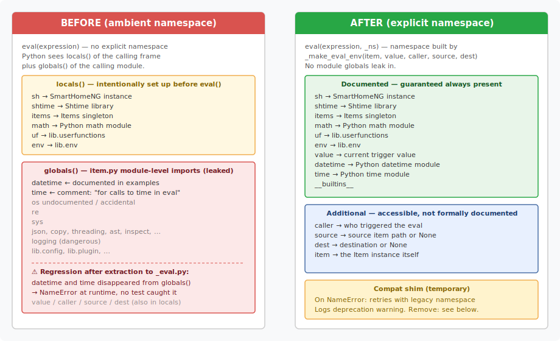
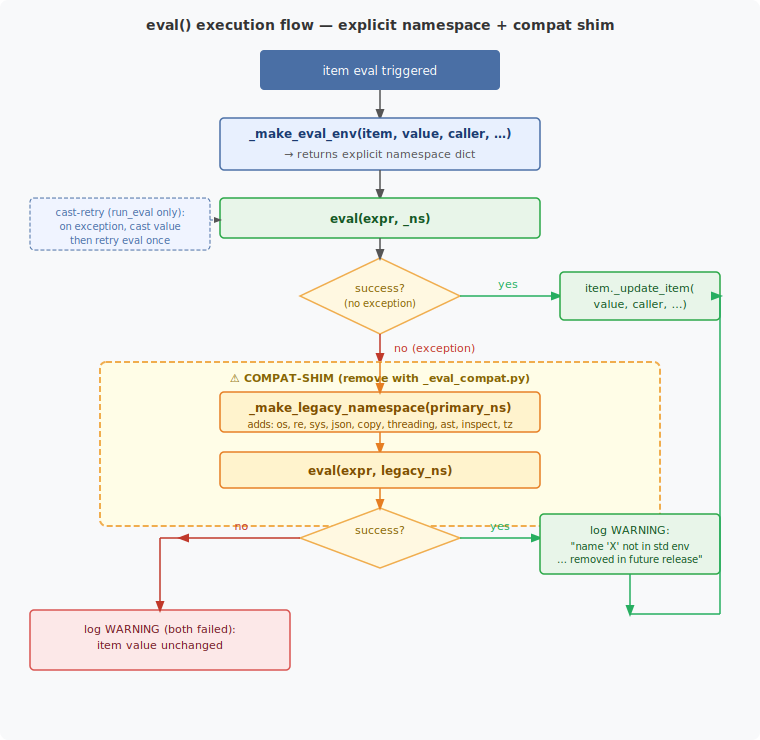

# `lib/item` — Eval Namespace Refactoring

_Context: part of the `lib/item/item.py` modularisation work documented in
[`lib_item_refactoring.md`](lib_item_refactoring.md)._

---

## Summary

Every `eval()` call that executes a user-written item expression now receives
an **explicit namespace dictionary** built by `_make_eval_env()`.  Previously
the calls used Python's ambient-namespace behaviour — a silent reliance on
local variables and module globals that broke undetected when the eval logic
was extracted from `item.py` into `lib/item/_eval.py`.

A **temporary compatibility shim** (`_eval_compat.py`) allows expressions that
reference previously-leaked names to keep working while emitting a deprecation
warning.

---

## 1. The Situation Before

### How `eval()` worked in the monolith

All eval calls lived inside `item.py`.  Python's `eval(expression)` — invoked
with no explicit namespace — automatically sees:

- **`locals()`** of the calling function — the variables that were
  deliberately set up before the `eval()` call: `sh`, `shtime`, `items`,
  `math`, `uf`, `env`.
- **`globals()`** of the calling *module* (`item.py`) — every import at the
  top of `item.py`: `datetime`, `time`, `os`, `re`, `sys`, `json`, `copy`,
  `threading`, `ast`, `inspect`, `logging`, `lib.config`, `lib.plugin`, …

The first group was intentional.  The second was *never documented* but
*always reachable*, so over time some user configurations came to rely on it.
Two of those leaked names — `datetime` and `time` — were even mentioned in the
official documentation examples:

```yaml
# From doc/user/source/beispiele/items/items_eval_evaltrigger.rst
eval: int((datetime.datetime.strptime(sh.x.end(), '%Y-%m-%dT%H:%M:%S')
           - datetime.datetime.now()).total_seconds())
```

```python
# item.py — explicit comment acknowledging the intention:
import time   # for calls to time in eval
```

### The extraction regression

When the eval logic was extracted to `lib/item/_eval.py` as part of the
modularisation rounds, the `globals()` visible inside the new module changed:
`_eval.py` only imports `logging` and `lib.env` — so `datetime`, `time`, `os`,
etc. **silently disappeared** from the eval environment.  An item like:

```yaml
eval: int(datetime.datetime.now().year)
```

would raise a `NameError` at runtime with no compile-time warning, and the
existing test suite would not catch it because no test used `datetime` inside
an eval expression.



---

## 2. The Fix — Explicit Namespace

### `_make_eval_env()`

`lib/item/_eval.py` now exports a single function that constructs the eval
namespace as an explicit dictionary:

```python
def _make_eval_env(item, value=None, caller=None, source=None, dest=None) -> dict:
    ...
```

Every `eval()` call across `_eval.py` and `_casting.py` passes this dict as
the second argument:

```python
_ns = _make_eval_env(item, value=value, caller=caller, source=source, dest=dest)
value = eval(item._eval, _ns)
```

### What is in the namespace

| Name | Type | Notes |
|---|---|---|
| `sh` | SmartHomeNG instance | Standard runtime object |
| `shtime` | Shtime | Date/time helpers |
| `items` | Items singleton | `items.return_item('path')` |
| `math` | module | Python `math` |
| `uf` | module | `lib.userfunctions` |
| `env` | module | `lib.env` |
| `value` | any | Trigger value; `None` for attribute evals |
| `datetime` | module | Python `datetime` — documented in examples |
| `time` | module | Python `time` — noted in original `item.py` |
| `caller` | str or None | Who triggered the eval |
| `source` | str or None | Source item path |
| `dest` | str or None | Destination |
| `item` | Item | The item instance itself |
| `__builtins__` | dict | Standard Python builtins |

`caller`, `source`, `dest`, and `item` were technically accessible via the old
ambient approach but were never documented.  They are included so that any
configuration that happened to rely on them continues to work.

### Benefits over the ambient approach

- **No module-global leakage** — `logging`, `os`, `lib.config`, `lib.plugin`,
  and all other `_eval.py` imports are no longer reachable.
- **Explicit and auditable** — the complete set of available names is defined
  in one function and covered by tests.
- **`datetime` and `time` regression fixed** — both are explicitly provided,
  regardless of which module the `eval()` call lives in.  As a follow-on
  cleanup, `import time  # for calls to time in eval` was removed from
  `item.py` — it is now only imported inside `_make_eval_env()`.
- **Consistent across all call sites** — `run_eval`, `run_on_xxx`, and
  `run_attribute_eval` previously had slightly different local setups (e.g.
  `run_on_xxx` omitted `env`).  All three now use the same helper.

---

## 3. The Compatibility Shim

Some existing user configurations may reference names that were previously
leaked via `item.py` module globals (`os`, `re`, `sys`, `json`, `copy`,
`threading`, `ast`, `inspect`, `dateutil.tz`) but are not part of the explicit
namespace.  To prevent a silent breakage, a **temporary fallback** is provided.

### How it works

```
eval(expr, explicit_ns)
  → NameError or other exception
  → _eval_with_legacy_fallback(expr, explicit_ns, item, context, exc)
      → _make_legacy_namespace(explicit_ns)   # adds os, re, sys, json, …
      → eval(expr, legacy_ns)
          → success  → log WARNING + return result
          → failure  → log WARNING (both failed) + return _EVAL_FAILED
```

On a successful fallback the log will contain a message such as:

```
WARNING lib.item: Item 'my.item': eval: name 'os' is not in the standard eval
environment but was found via the legacy namespace.  This compatibility retry
will be removed in a future release.  Please update your configuration to use
only the documented eval variables: sh, shtime, items, math, uf, env, value,
datetime, time.
```



### File layout

```
lib/item/
  _eval.py          _make_eval_env()   ← explicit namespace builder
                    run_eval()
                    run_on_xxx()
  _casting.py       run_attribute_eval()
  _eval_compat.py   _EVAL_FAILED       ← sentinel
                    _make_legacy_namespace()
                    _eval_with_legacy_fallback()   ← the shim
```

All call sites that invoke the fallback are marked with `# COMPAT-SHIM`:

```python
# _eval.py — run_eval, main eval:
try:
    value = eval(item._eval, _ns)
except Exception:
    _ns['value'] = item.cast(_ns.get('value'))
    value = eval(item._eval, _ns)
except Exception as _e:                              # COMPAT-SHIM
    _fb = _eval_with_legacy_fallback(               # COMPAT-SHIM
        item._eval, _ns, item, 'eval', _e)          # COMPAT-SHIM
    if _fb is _EVAL_FAILED:                         # COMPAT-SHIM
        raise _e                                    # COMPAT-SHIM
    value = _fb                                     # COMPAT-SHIM
```

### Removal procedure

When the project is ready to enforce the explicit namespace and break
compatibility with undocumented variable usage:

**Step 1** — delete `lib/item/_eval_compat.py`.

**Step 2** — in `lib/item/_eval.py`, remove:
```python
# COMPAT-SHIM: remove this import together with _eval_compat.py
from ._eval_compat import _eval_with_legacy_fallback, _EVAL_FAILED
```
Then delete every `except` block whose entire body is marked `# COMPAT-SHIM`.
The surrounding `try` and outer exception handlers were present before the shim
was added and continue to work.

**Step 3** — in `lib/item/_casting.py`, same as step 2.

After removal, any expression that references an undocumented name will produce
a plain error log (the same message that currently appears as the second line
of the fallback warning).

---

## 4. Test Coverage

62 tests in `tests/test_item_eval_namespace.py` act as the before/after gate
for this change.

| Test class | Tests | What it verifies |
|---|---:|---|
| `TestMakeEvalEnvKeys` | 15 | Every key in the explicit namespace dict |
| `TestRunEvalDocumentedVars` | 13 | `value`, `math`, `datetime`, `time`, `caller`, `source`, `sh` in real `__run_eval` calls |
| `TestRunEvalItemAccess` | 5 | `item._path`, `item._type`, `item.property.type/path`, identity |
| `TestRunEvalItemsAccess` | 3 | `items.return_item()` lookup and live-value tracking |
| `TestOnChangeNamespace` | 6 | `value` / arithmetic / `sh.` / `math` in `on_change` and `on_update` |
| `TestRunAttributeEvalDirect` | 8 | `run_attribute_eval()` — numeric, math, `sh.`, quoting-retry, error sentinel |
| `TestEvalCompatShim` | 9 | Fallback success + `_EVAL_FAILED` + warning content; `datetime`/`time` in primary ns |
| `TestRunEvalCompatIntegration` | 3 | Full-stack: `os` in eval still works (compat), unknown name no crash, `re` in `on_change` |

The `datetime` and `time` tests are the critical regression gate: they would
have failed silently on the extracted `_eval.py` before this fix.

---

## 5. What Users Should Do

If you see a log warning containing _"not in the standard eval environment but
was found via the legacy namespace"_, update the offending item configuration
to avoid the unlisted variable.  Common replacements:

| Was used (leaked) | Recommended alternative |
|---|---|
| `os.path.exists(...)` | use `sh.` item reference or a user function in `uf` |
| `re.sub(...)` | move the logic into a user function: `uf.my_func(value)` |
| `json.loads(...)` | move into a user function |
| `sys.platform` | use `env` properties or a user function |
| `datetime.datetime.now()` | already in explicit namespace — no change needed |
| `time.time()` | already in explicit namespace — no change needed |
