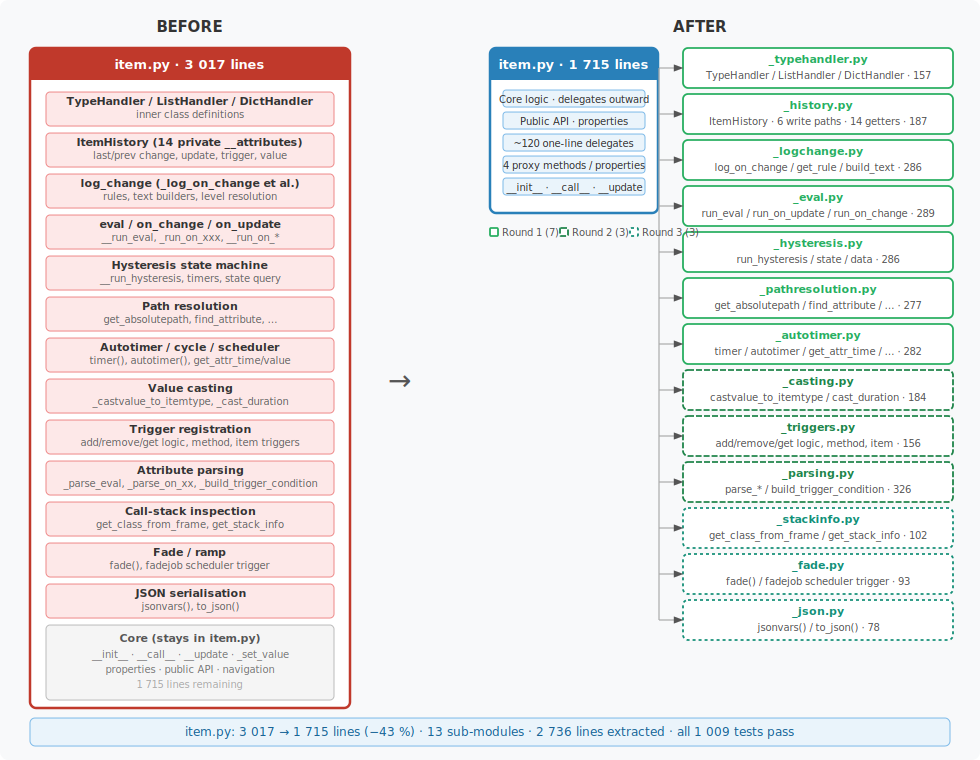
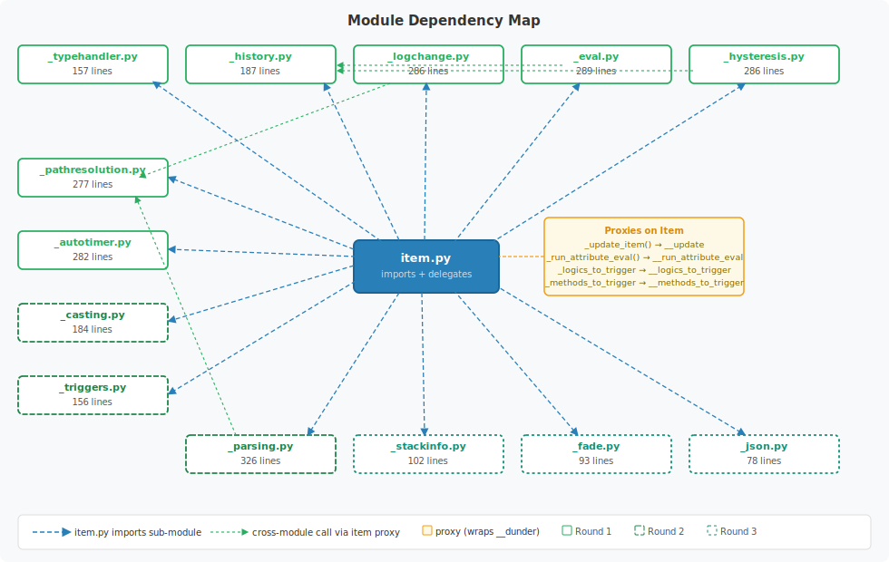
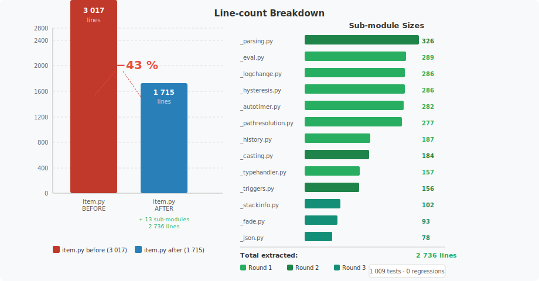

# `lib/item` — Test Coverage & Refactoring

A record of the test-coverage and modularisation work carried out on
`lib/item/item.py` (SmartHomeNG's central Item class).

---

## Overview

`lib/item/item.py` began as a **3 017-line monolith** containing every concern
of the SmartHomeNG Item object: type handling, history tracking, eval
expressions, log-change rules, hysteresis state machine, autotimer/cycle
scheduler wiring, path resolution, attribute parsing, value casting,
trigger registration, stack inspection, fade/ramp, JSON serialisation,
and more.

The work proceeded in three phases:

1. **Safety net** — write comprehensive unit tests before touching anything.
2. **Extraction rounds 1 & 2** — ten sub-modules; `item.py` down to −39 %.
3. **Extraction round 3** — three further sub-modules + dead-code removal;
   `item.py` down to **−43 %**.

---

## Result at a Glance

| Metric | Before | After |
|---|---:|---:|
| `item.py` lines | 3 017 | 1 715 |
| Lines removed from `item.py` | — | −1 302 (−43 %) |
| Sub-modules created | 0 | 13 |
| Total sub-module lines | 0 | 2 736 |
| New test files | 0 | 10 |
| New tests | 0 | 320 |
| Full test-suite size | 689 | 1 009 |
| Test-suite result | — | **1 009 passed** |



---

## Phase 1 — Safety Net (10 test files, 320 tests)

Tests were written **before** any production code was changed so that every
extraction could be validated immediately.

### Pre-extraction tests (7 files, 240 tests)

| Test file | Tests | Covers |
|---|---:|---|
| `test_item_typehandler.py` | 35 | `TypeHandler`, `ListHandler`, `DictHandler`, `HANDLER_MAP` |
| `test_item_history.py` | 34 | `ItemHistory` — all 6 write paths and 14 getters |
| `test_item_pathresolution.py` | 30 | `get_absolutepath`, `get_stringwithabsolutepathes`, `find_attribute`, `expand_relativepathes` |
| `test_item_autotimer.py` | 32 | `_parse_cycle_attribute`, `_init_start_scheduler`, `timer`, `autotimer`, `remove_timer`, `_cast_duration` |
| `test_item_eval.py` | 37 | `_parse_eval_attribute`, `_parse_on_xx_list_attribute`, `__run_eval`, on_change/on_update execution |
| `test_item_hysteresis.py` | 29 | Hysteresis config parsing, `hysteresis_state`, `hysteresis_data`, helper methods |
| `test_item_logchange.py` | 43 | `_log_on_change`, `_get_rule`, `_log_build_standardtext`, `_log_build_text`, all filter/limit rules |

### Post-extraction gap-fill tests (3 files, 80 tests)

Added after analysis revealed gaps in coverage for the next set of extraction
candidates.

| Test file | Tests | Covers |
|---|---:|---|
| `test_item_castvalue.py` | 22 | `_castvalue_to_itemtype` — all item types, compat modes, failure/fallback paths |
| `test_item_triggers.py` | 32 | `add/remove/get_logic_triggers`, `add/remove/get_method_triggers`, `get_item_triggers`, `get_hysteresis_item_triggers` |
| `test_item_trigger_condition.py` | 26 | `_build_trigger_condition_eval` — `=`→`==` rewrite, true/False normalisation, AND/OR joining, relative path expansion |


---

## Phase 2 — Modular Extraction Round 1 (7 sub-modules, −34 %)

Each extraction followed the same pattern:

1. Write the module-level function(s) accessing only `_single_underscore`
   attributes and public methods on `Item` (avoiding Python name-mangling).
2. Add thin proxy methods/properties to `Item` where private (`__dunder`)
   attributes must still be reached.
3. Replace the original method body in `item.py` with a one-line delegate.
4. Run the full test suite — all green before proceeding.



### `_typehandler.py` — 157 lines

**Extracted from:** inner-class definitions inside `Item`.

| Symbol | Role |
|---|---|
| `TypeHandler` | Base class — validates item type on construction |
| `ListHandler` | Proxy for all list mutation methods (`append`, `prepend`, `insert`, `pop`, `extend`, `clear`, `delete`, `remove`) |
| `DictHandler` | Proxy for all dict mutation methods (`get`, `delete`, `clear`, `pop`, `popitem`, `update`) |
| `HANDLER_MAP` | `{'list': ListHandler, 'dict': DictHandler}` — used in `Item.__init__` |

---

### `_history.py` — 187 lines

**Extracted from:** 14 private `__dunder` timestamp/caller attributes.

`ItemHistory` (using `__slots__`) owns 6 write methods and 14 getters covering
last/prev change, update, trigger, and value tracking.

---

### `_logchange.py` — 286 lines

**Extracted from:** `Item._log_on_change`, `_get_rule`, `_log_build_standardtext`, `_log_build_text`.

| Function | Role |
|---|---|
| `log_on_change(item, value, caller, source, dest)` | Entry point — checks logger, applies rules, builds text, logs |
| `get_rule(item, rule_entry)` | Retrieves and normalises a single `log_rules` entry |
| `build_standardtext(item, ...)` | Default log text |
| `build_text(item, ...)` | Evaluates `log_text` as an f-string with 20+ named variables |

---

### `_eval.py` — 289 lines

**Extracted from:** `__run_eval`, `_run_on_xxx`, `__run_on_update`, `__run_on_change`.

Proxy added: `_update_item()` → `__update()`.

---

### `_hysteresis.py` — 286 lines

**Extracted from:** `__run_hysteresis`, `hysteresis_state`, `hysteresis_data`, `_onoff`, `_get_hysterisis_state_string`.

Proxy added: `_run_attribute_eval()` → `__run_attribute_eval()`.

---

### `_pathresolution.py` — 277 lines

**Extracted from:** `get_absolutepath`, `get_stringwithabsolutepathes`, `find_attribute`,
`_split_destitem_from_value`, `expand_relativepathes`.

No name-mangling issues — all attributes accessed are single-underscore or public.

---

### `_autotimer.py` — 282 lines

**Extracted from:** `_init_start_scheduler`, `__get_items_from_string`, `get_attr_time`,
`get_attr_value`, `timer`, `remove_timer`, `autotimer`.

---

## Phase 3 — Modular Extraction Round 2 (3 sub-modules, −39 % cumulative)

### `_casting.py` — 184 lines

**Extracted from:** `_castvalue_to_itemtype`, `_cast_duration`.

Key design choice: replaced `globals()['cast_' + self._type]` lookup with an
explicit `_CAST_MAP` dict populated from direct imports — readable and
independent of another module's global namespace.

Also **deleted** dead code `_cast_duration_old` (superseded).

---

### `_triggers.py` — 156 lines

**Extracted from:** `add/remove/get_logic_triggers`, `add/remove/get_method_triggers`,
`get_item_triggers`, `get_hysteresis_item_triggers`.

Proxies added (properties returning mangled lists):

```python
@property
def _logics_to_trigger(self):
    return self.__logics_to_trigger

@property
def _methods_to_trigger(self):
    return self.__methods_to_trigger
```

Also **deleted** dead code `_build_cycledict` (never called).

---

### `_parsing.py` — 326 lines

**Extracted from:** `_parse_eval_attribute`, `_parse_eval_trigger_list_attribute`,
`_parse_hysteresis_input_attribute`, `_parse_hysteresis_xx_threshold_attribute`,
`_parse_on_xx_list_attribute`, `_parse_cycle_attribute`, `_parse_autotimer_attribute`,
`_build_trigger_condition_eval`.

`ATTRIB_COMPAT_DEFAULT` (mutable module-level global in `item.py`) is forwarded
as a parameter through the delegate to avoid circular import:

```python
def _parse_cycle_attribute(self, attr, value):
    _parse_cycle_attribute(self, attr, value, ATTRIB_COMPAT_DEFAULT)
```

---

## Phase 4 — Modular Extraction Round 3 (3 sub-modules, −43 % cumulative)

### `_stackinfo.py` — 102 lines

**Extracted from:** `get_class_from_frame`, `get_calling_item_from_frame`, `get_stack_info`.

Frame-inspection utilities used to enrich log messages when dict/list entries
are accessed via eval expressions.  Pure `inspect` usage — no name-mangling
issues.

---

### `_fade.py` — 93 lines

**Extracted from:** `Item.fade`.

Validates `stop_fade`/`continue_fade` list parameters, stores fade-state in
`item._fadingdetails`, then triggers the first `fadejob` call via the
SmartHomeNG scheduler.  The actual step-by-step ramp logic lives in
`fadejob` (already in `helpers.py`).

---

### `_json.py` — 78 lines

**Extracted from:** `Item.jsonvars`, `Item.to_json`.

```python
def jsonvars(item):
    return {"id": item._path, "name": item._name, "value": item._value,
            "type": item._type, "attributes": item.conf,
            "children": item.get_children_path()}

def to_json(item):
    return json.dumps(jsonvars(item), sort_keys=True, indent=2)
```

---

## Line-count Reduction



```
item.py  ████████████████████████████████░░░░░░░░░░░░░░░░░░░░  3017 → 1715  (−1302, −43 %)

Moved into sub-modules:
  _parsing.py        ████ 326 lines
  _eval.py           ████ 289 lines
  _logchange.py      ████ 286 lines
  _hysteresis.py     ████ 286 lines
  _autotimer.py      ████ 282 lines
  _pathresolution.py ███  277 lines
  _history.py        ██   187 lines
  _casting.py        ██   184 lines
  _triggers.py       ██   156 lines
  _typehandler.py    ██   157 lines
  _stackinfo.py      █    102 lines
  _fade.py           █     93 lines
  _json.py           █     78 lines
                          ─────────
                          2 736 lines in 13 sub-modules
```

---

## Key Design Principles

### No name-mangling outside the class

All extracted functions use only single-underscore attributes and public methods,
or call through explicit proxy methods/properties added to `Item`:

| Proxy | Wraps |
|---|---|
| `_update_item()` | `__update()` |
| `_run_attribute_eval()` | `__run_attribute_eval()` |
| `_logics_to_trigger` (property) | `__logics_to_trigger` list |
| `_methods_to_trigger` (property) | `__methods_to_trigger` list |

### Thin delegate pattern

Every original `Item` method is kept as a one-line delegate so the public API
and all scheduler callbacks remain unchanged.

```python
# before
def __run_eval(self, value=None, caller='Eval', source=None, dest=None):
    if caller.lower().startswith('admin:'):
        ...  # 90 lines of logic

# after
def __run_eval(self, value=None, caller='Eval', source=None, dest=None):
    run_eval(self, value=value, caller=caller, source=source, dest=dest)
```

### Test-first, extract-second

Every extraction was preceded by a full green test run and re-run immediately
after.  No extraction introduced a single regression across all three rounds.

---

## Files Changed / Created

### New source files

| File | Lines | Round | Description |
|---|---:|---:|---|
| `lib/item/_typehandler.py` | 157 | 1 | List/dict handler proxy classes |
| `lib/item/_history.py` | 187 | 1 | `ItemHistory` — timestamp & caller tracking |
| `lib/item/_logchange.py` | 286 | 1 | log_change rules, text builders |
| `lib/item/_eval.py` | 289 | 1 | eval / on_change / on_update runners |
| `lib/item/_hysteresis.py` | 286 | 1 | Hysteresis state machine |
| `lib/item/_pathresolution.py` | 277 | 1 | Path resolution helpers |
| `lib/item/_autotimer.py` | 282 | 1 | Autotimer / cycle / scheduler helpers |
| `lib/item/_casting.py` | 184 | 2 | `castvalue_to_itemtype`, `cast_duration` |
| `lib/item/_triggers.py` | 156 | 2 | Trigger registration / query |
| `lib/item/_parsing.py` | 326 | 2 | Attribute parsers + trigger condition builder |
| `lib/item/_stackinfo.py` | 102 | 3 | Call-stack inspection utilities |
| `lib/item/_fade.py` | 93 | 3 | Fade/ramp scheduler helper |
| `lib/item/_json.py` | 78 | 3 | JSON serialisation |

### New test files

| File | Tests | Description |
|---|---:|---|
| `tests/test_item_typehandler.py` | 35 | TypeHandler / ListHandler / DictHandler |
| `tests/test_item_history.py` | 34 | ItemHistory write/read paths |
| `tests/test_item_pathresolution.py` | 30 | Path resolution functions |
| `tests/test_item_autotimer.py` | 32 | Autotimer/cycle/timer API |
| `tests/test_item_eval.py` | 37 | Eval config parsing and execution |
| `tests/test_item_hysteresis.py` | 29 | Hysteresis state machine |
| `tests/test_item_logchange.py` | 43 | log_change rules and text builders |
| `tests/test_item_castvalue.py` | 22 | `_castvalue_to_itemtype` all types |
| `tests/test_item_triggers.py` | 32 | Trigger registration / firing |
| `tests/test_item_trigger_condition.py` | 26 | `_build_trigger_condition_eval` |

### Modified files

| File | Change |
|---|---|
| `lib/item/item.py` | −1 302 lines; 13 import blocks; ~120 one-line delegates; 4 proxies (2 methods + 2 properties); 2 dead methods deleted |
| `tests/mock/core.py` | Added `self.plugins_version`; fixed `lib.item.Item` → `lib.item.item.Item` |
| `tests/test_item_logchange.py` | Updated to use module-level `log_on_change(item, …)` |
| `tests/test_item_hysteresis.py` | Updated to use `_onoff(v)` / `_get_hysteresis_state_string(item, …)` |
| `tox.ini` | Added `--ignore-glob=plugins/*/_pv_*` to pytest `addopts` |
