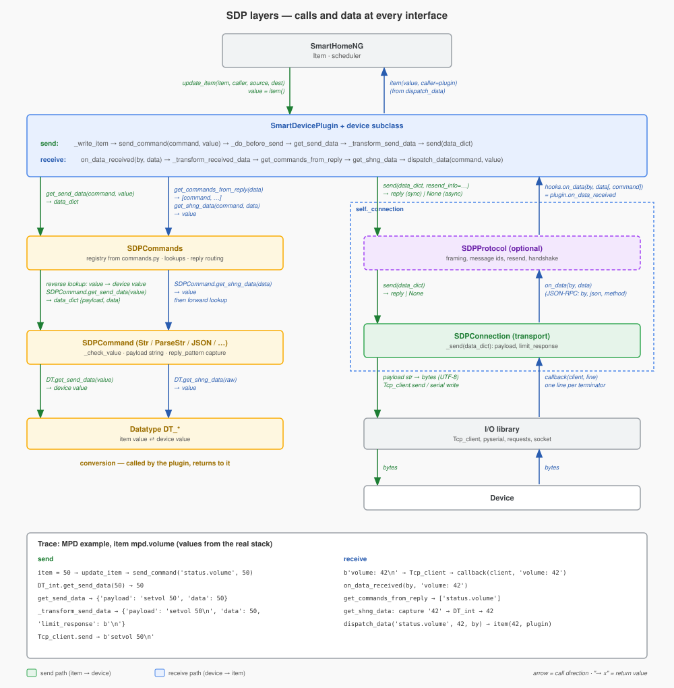
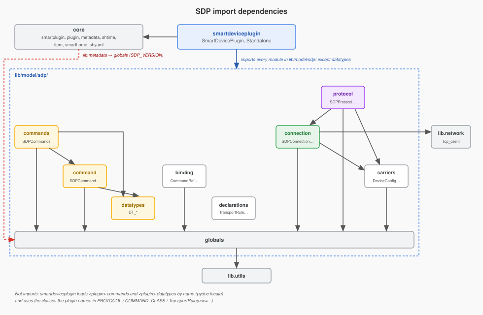
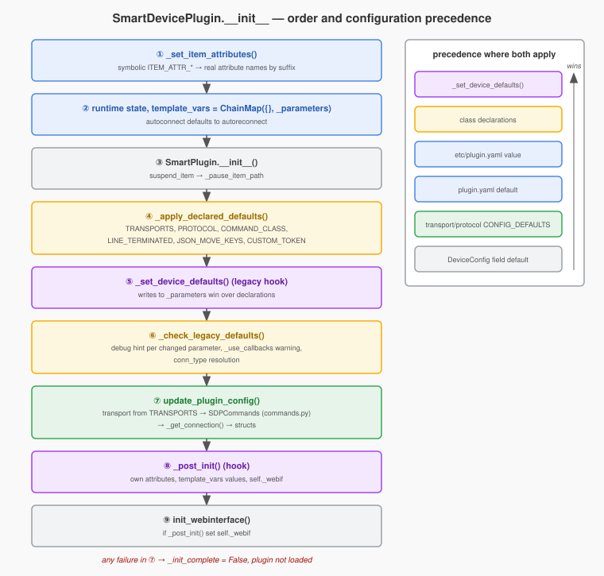
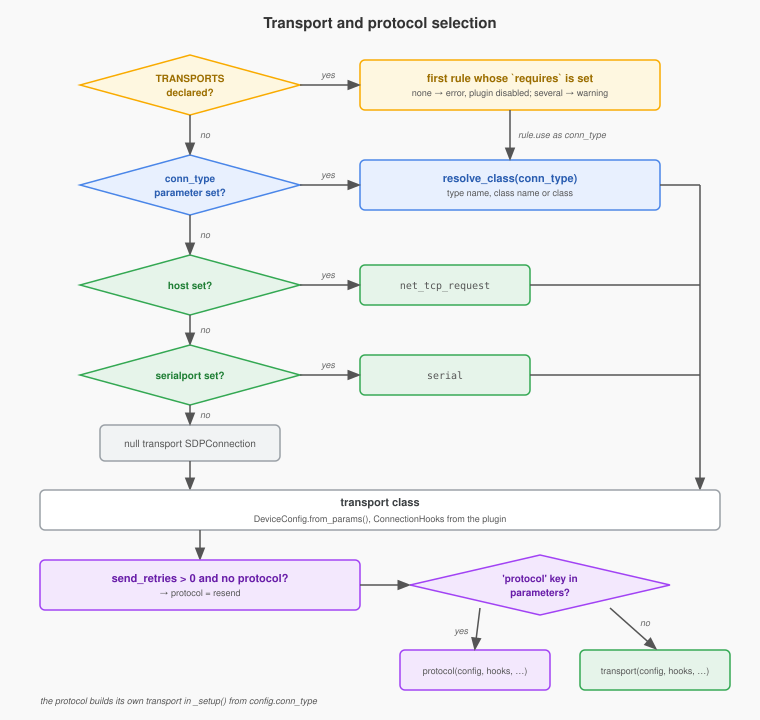
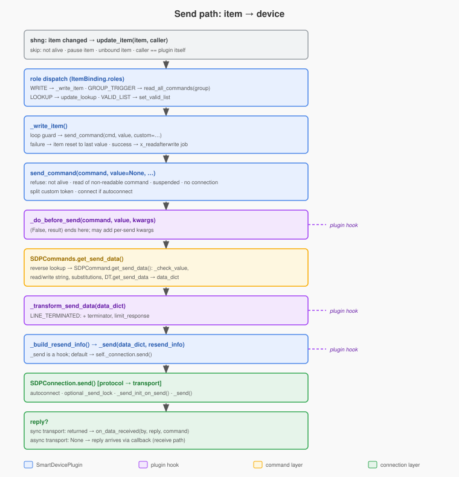
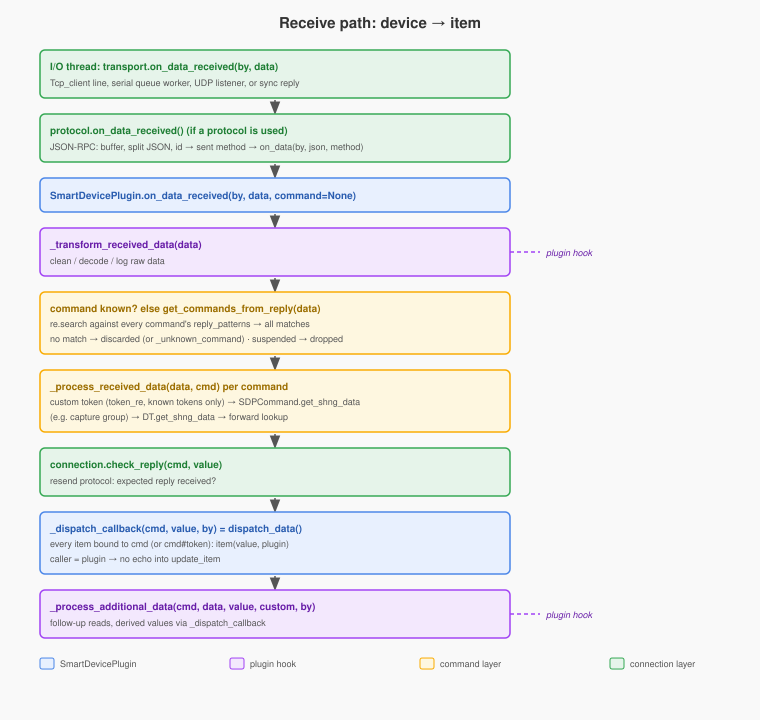
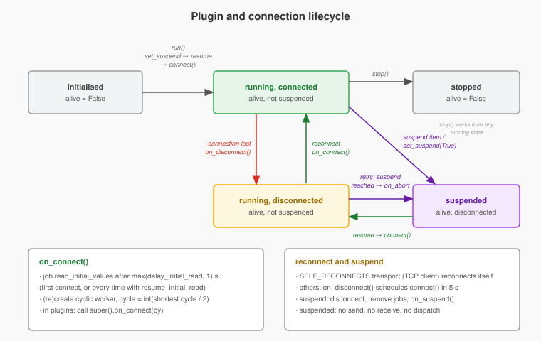

# SmartDevicePlugin (SDP) 2.0 — Architecture and Internals

Audience: developers working **on** SDP itself (`lib/model/smartdeviceplugin.py`,
`lib/model/sdp/`). Plugin authors who build a device plugin **with** SDP start
with [`sdp_plugin_guide.md`](sdp_plugin_guide.md) instead.

The document explains how the parts fit together and why, how data moves
through them, and where the seams are. It does not list every member; the
docstrings and the code are the reference for that.

Contents

1. [What SDP is](#1-what-sdp-is)
2. [Layers](#2-layers)
3. [Module map and dependencies](#3-module-map-and-dependencies)
4. [Typed contracts](#4-typed-contracts)
5. [Initialisation and configuration resolution](#5-initialisation-and-configuration-resolution)
6. [Transport and protocol selection](#6-transport-and-protocol-selection)
7. [Item binding](#7-item-binding)
8. [Send path: item → device](#8-send-path-item--device)
9. [Receive path: device → item](#9-receive-path-device--item)
10. [Initial, cyclic and group reads](#10-initial-cyclic-and-group-reads)
11. [Connection lifecycle: suspend, resume, reconnect](#11-connection-lifecycle-suspend-resume-reconnect)
12. [Threads and locks](#12-threads-and-locks)
13. [Custom tokens (one plugin, several devices)](#13-custom-tokens-one-plugin-several-devices)
14. [Standalone mode and the struct generator](#14-standalone-mode-and-the-struct-generator)
15. [API surface: stable, public, internal](#15-api-surface-stable-public-internal)
16. [Extension seams](#16-extension-seams)
17. [Test infrastructure](#17-test-infrastructure)
18. [Design decisions of 2.0](#18-design-decisions-of-20)
19. [Known limitations](#19-known-limitations)

---

## 1. What SDP is

`SmartDevicePlugin` is a `SmartPlugin` subclass that implements a complete
device plugin: item parsing, command lookup, value conversion, connection
handling, initial/cyclic reads, suspend/resume and reconnect. A concrete
device plugin supplies data (`commands.py`, optional `datatypes.py`, its
`plugin.yaml`) plus a few class attributes, and overrides hooks only where the
device needs special handling.

Version constant: `SDP_VERSION = '2.0.0'` in `lib/model/sdp/globals.py`. A
plugin declares `sdp_minversion` / `sdp_maxversion` in its `plugin.yaml`;
`Metadata.test_sdpcompatibility()` (`lib/metadata.py`) refuses to load a
plugin whose range excludes `SDP_VERSION`.

## 2. Layers



| Layer | Class(es) | Works on | Responsibility |
|---|---|---|---|
| shng | `Item`, `Items`, scheduler | item values | owns state, calls `update_item()` |
| plugin | `SmartDevicePlugin` + device subclass | command names, item values | binding, dispatch, read scheduling, suspend, hooks |
| command registry | `SDPCommands` | command names, lookups | loads `commands.py`, models, lookups, reply pattern routing |
| command | `SDPCommand` and subclasses | one command | builds the send `data_dict`, extracts the reply value, value checks |
| datatype | `Datatype`, `DT_*` | one value | converts item value ⇄ device value |
| protocol (optional) | `SDPProtocol` and subclasses | `data_dict` | framing, message ids, resend, handshakes; wraps a transport |
| transport | `SDPConnection` and subclasses | `data_dict` / raw bytes or str | open/close/send/receive on network or serial |
| I/O library | `lib.network.Tcp_client`, `pyserial`, `requests`, sockets | bytes | actual I/O |

A protocol **is** an `SDPConnection` (subclass) that owns another
`SDPConnection` (the transport) in `self._connection`. The plugin only ever
holds one object in `self._connection`: either a bare transport or a protocol
wrapping one. Everything above the protocol is unaware of which it is.

## 3. Module map and dependencies

| Module | Contents |
|---|---|
| `lib/model/smartdeviceplugin.py` | `SmartDevicePlugin`, `Standalone` (CLI + struct generator), `SDPResultError`, `BINDING_KEY = 'sdp'` |
| `lib/model/sdp/globals.py` | constants (parameter names, item attribute suffixes, command keys, substitution tokens, connection/protocol type names), exceptions, `sanitize_param()`, `resolve_class()`, `update()` (deep dict merge) |
| `lib/model/sdp/declarations.py` | `TransportRule`, `CustomTokenSpec` — types for the class-attribute declarations |
| `lib/model/sdp/binding.py` | `CommandRef`, `ItemRole`, `ItemBinding`, `ValidListBinding`, `CyclicSchedule` |
| `lib/model/sdp/carriers.py` | contracts between plugin, protocol and transport: `DeviceConfig` (connection settings), `ConnectionHooks` (callbacks), `SchedulerPort` (scheduler interface), `SendData` (keys of the per-send `data_dict`) |
| `lib/model/sdp/commands.py` | `SDPCommands` — command registry, model selection, lookups, `DT_*` discovery |
| `lib/model/sdp/command.py` | `SDPCommand`, `SDPCommandStr`, `SDPCommandParseStr`, `SDPCommandJSON`, `SDPCommandViessmann` |
| `lib/model/sdp/datatypes.py` | `Datatype` and the generic `DT_*` classes |
| `lib/model/sdp/connection.py` | `SDPConnection` (null transport) and the transports, `CONNECTION_CLASSES` |
| `lib/model/sdp/protocol.py` | `SDPProtocol` (pass-through), `SDPProtocolJsonrpc`, `SDPProtocolResend`, `PROTOCOL_CLASSES` |
| `lib/model/sdp/examples/` | `plugin.yaml` and `webif` templates |
| `dev/sample_smartdevice_plugin/` | annotated sample plugin, reference `commands.py`, contract test |
| `dev/sample_smartdevice_standalone_plugin/` | sample with a `run_standalone()` |



Imports point one way only (arrow = "imports"):

- `declarations` and `datatypes` import no SDP module.
- `binding` and `carriers` import `globals`; `globals` imports `lib.utils`.
- `command` imports `datatypes` and `globals`; `commands` imports `command`,
  `datatypes` and `globals`.
- `connection` imports `carriers`, `globals` and `lib.network`; `protocol`
  imports `connection`, `carriers` and `globals`.
- `smartdeviceplugin` imports every module in `lib/model/sdp/` except
  `datatypes`, plus core modules (`smartplugin`, `plugin`, `metadata`,
  `shtime`, `item`, `smarthome`, `shyaml`).
- Nothing in `lib/model/sdp/` imports `smartdeviceplugin`. The one edge from
  core into SDP: `lib/metadata.py` imports `SDP_VERSION` from `globals` for
  the `sdp_minversion` check.

Cross-cutting coupling: the builtin flag `SDP_standalone`. Each SDP plugin
module sets `builtins.SDP_standalone` at import time (`True` when run as
`__main__`, else `False` unless already set). `smartdeviceplugin`,
`commands` and `connection` read it as a bare name. Code that imports SDP
modules outside a plugin (tests, tools) sets it first; see
`tests/sdp_harness/__init__.py`.

Device-specific code that SDP loads by convention from the plugin package
(`PLUGIN_PATH` = the plugin's class path):

- `<plugin>.commands` — required, loaded with `pydoc.locate()`
- `<plugin>.datatypes` — optional, every `DT_*` class in it
- protocol or command classes — referenced directly by the class attributes
  `PROTOCOL` / `COMMAND_CLASS` (e.g. viessmann's `SDPProtocolViessmann` in
  `plugins/viessmann/protocol.py`)

## 4. Typed contracts

2.0 replaced loosely-typed dicts and positional callbacks with small typed
carriers. They are the vocabulary of the rest of this document.

### Declarations (`declarations.py`)

```python
TransportRule(use, requires=None)      # use: connection type name or class; requires: parameter name
CustomTokenSpec(index, token_re, reply_re, recursive=False)
```

`TransportRule.matches(params)` is true without `requires`, or when that
parameter is truthy.

### Bindings (`binding.py`)

- `CommandRef(str)` — a command name, optionally with custom token. Its string
  value is the wire/mapping form `name` or `name#token`; `.name` / `.token`
  hold the parts. Being a `str`, it is used directly as the `SmartPlugin`
  mapping key, so `get_items_for_mapping('cmd#tok')` finds items bound with
  `CommandRef('cmd', 'tok')`. String operations return plain `str`;
  `CommandRef.parse()` splits at the first `#`.
- `ItemRole(Flag)` — `READ`, `WRITE`, `GROUP_TRIGGER`, `LOOKUP`, `VALID_LIST`;
  roles combine. There is no "receive" role: every item with a command
  receives that command's values regardless of roles.
- `ItemBinding` — everything `parse_item()` derived for one item: roles,
  command, read groups, initial flag, cycle, trigger group, lookup, valid
  list, custom attribute values.
- `CyclicSchedule` — the only stateful structure: cycle and next due time per
  command and per trigger group. `sync()` replaces the cycle sets and keeps
  due times of entries that survive.

### Carriers (`carriers.py`)

- `DeviceConfig` (frozen dataclass) — connection/protocol settings. Field
  names equal the plugin parameter names (`host`, `port`, `serialport`,
  `baudrate`, …, `send_retries`, `send_timeout`, `json_move_keys`).
  `extra` holds all other plugin parameters (e.g. `viess_proto`), `explicit`
  the names that were set. `from_params()` treats `None` as unset and runs
  `sanitize_param()` on values; `with_defaults()` fills only fields not in
  `explicit`.
- `ConnectionHooks` (frozen) — `on_data(by, data[, command])`,
  `on_connect(by)`, `on_disconnect(by)`, `on_abort(by)`.
- `SchedulerPort` (Protocol) — `scheduler_add/get/remove`; `SmartPlugin`
  satisfies it, so the plugin is passed as scheduler.
- `SendData` (TypedDict) — documented keys of the `data_dict` (`payload`,
  `data`, `limit_response`, `request_method`, `params`, `headers`, …).

Every transport and protocol has one constructor:

```python
SDPConnection(config: DeviceConfig, hooks: ConnectionHooks | None = None,
              scheduler: SchedulerPort | None = None, name: str | None = None)
```

Subclasses never override `__init__`; they implement `_setup()`, which runs
after `self._config` (with class defaults applied), `self._hooks`,
`self._scheduler` and `self._name` exist. The pre-2.0 signature
`(data_received_callback, name=None, **params)` is converted by
`_from_legacy_args()` with a one-time warning per class.

## 5. Initialisation and configuration resolution



`SmartDevicePlugin.__init__()` in order:

1. `_set_item_attributes()` maps each symbolic name in `ATTR_NAMES`
   (`ITEM_ATTR_COMMAND`, …) to the plugin's real attribute name by suffix match
   against `metadata.itemdefinitions` (e.g. `ITEM_ATTR_COMMAND` →
   `denon_command`). Only suffixes matter; any prefix works.
2. Runtime state: `CyclicSchedule`, loop guard parameters, `cycle`,
   `delay_initial_read`, `resume_initial_read`, `_dispatch_callback =
   dispatch_data`, `_discard_unknown_command = True`.
3. `template_vars = ChainMap({}, self._parameters)` — values for
   `{PARAM:x}` / `{CUSTOM_PARAMn:x}`; plugin code writes runtime values into
   the first map, lookups fall back to the parameters.
4. `autoconnect` defaults to `autoreconnect` when unset.
5. `SmartPlugin.__init__()`; `suspend_item` becomes `_pause_item_path`.
6. **Device defaults**, three sources, later wins:
   1. plugin parameters from `etc/plugin.yaml` (via metadata),
   2. class-attribute declarations — `_apply_declared_defaults()`,
   3. legacy `_set_device_defaults()` writes to `self._parameters`.

   `_check_legacy_defaults()` compares parameters before/after
   `_set_device_defaults()` and logs changed framework parameters at debug
   level (hint to move them to declarations), warns once per class about an
   obsolete `_use_callbacks` attribute, and resolves `conn_type`: with
   `TRANSPORTS` declared, `conn_type` is set to a sentinel before the hook; if
   the hook overwrote it, the hook wins and rule selection is off, otherwise
   the configured value is restored and — if one was configured — a warning
   says it is ignored.
7. `update_plugin_config(**kwargs)` (also the reconfiguration entry point,
   refused while `alive`):
   1. transport from `TRANSPORTS` rules (no match → error, plugin disabled),
   2. command class from `command_class` (default `SDPCommand`),
   3. `_read_configuration()` → `SDPCommands(cls, template_vars=…, **params)`,
   4. `_get_connection()` → protocol or transport instance,
   5. `_import_structs()` registers `<plugin>.MODEL` from the matching
      `<plugin>.<model>` or `<plugin>.ALL` struct.

   Any failure sets `_init_complete = False`.
8. `_post_init()` hook.
9. `init_webinterface()` if `_post_init()` set `self._webif`.

Inside the connection, a final source applies:
`SDPConnection.__init__` calls `config.with_defaults(self._config_defaults(config))`.
`CONFIG_DEFAULTS` (or an overridden `_config_defaults()`) fills only fields
nobody set — e.g. `SDPProtocolJsonrpc` defaults `port=9090`,
`send_retries=3`, `conn_type=net_tcp_client`; viessmann's protocol derives
serial settings from `viess_proto`.

Resulting precedence for any connection setting:
`_set_device_defaults()` > declarations > `etc/plugin.yaml` > `plugin.yaml`
default > transport/protocol `CONFIG_DEFAULTS` > `DeviceConfig` field default.
(The `plugin.yaml` default enters through metadata as a configured value.)

## 6. Transport and protocol selection



`_get_connection()`:

1. `_connection_params()` copies the parameters; if `send_retries` is set and
   no protocol is chosen, it selects `PROTO_RESEND` (other protocols get a
   debug note that resend may not apply).
2. Transport class: `SDPConnection._get_connection_class()` — explicit class
   argument, else `conn_type` (name, class name or class, via
   `resolve_class()`), else `host` → `net_tcp_request`, else `serialport` →
   `serial`, else the null transport `SDPConnection`. `net_tcp_jsonrpc` is
   rejected with a hint to use `net_tcp_client` + protocol `jsonrpc`.
3. `DeviceConfig.from_params()`, `ConnectionHooks` from the plugin's
   `on_data_received` / `on_connect` / `on_disconnect` and
   `on_abort = partial(set_suspend, True)`.
4. If the parameters contain the key `protocol`, the protocol class
   (`_get_protocol_class()`, empty → pass-through `SDPProtocol`) is
   instantiated; its `_setup()` builds the inner transport with hooks pointing
   back to the protocol's own `on_data_received/on_connect/on_disconnect` and
   forwards `on_abort` unchanged. Otherwise the transport is instantiated
   directly.

| Type name (`globals`) | Class | Reply model |
|---|---|---|
| `''` (`CONN_NULL`) | `SDPConnection` | none; logs, returns `None` |
| `net_tcp_request` | `SDPConnectionNetTcpRequest` | synchronous: HTTP via `requests`, returns `response.text` |
| `net_tcp_client` | `SDPConnectionNetTcpClient` | asynchronous: persistent `Tcp_client`, replies via callback; `SELF_RECONNECTS` |
| `net_udp_server` | `SDPConnectionNetUdpRequest` | HTTP requests + UDP listener thread for notifications |
| `serial` | `SDPConnectionSerial` | synchronous: `_send()` reads the reply up to `limit_response` |
| `serial_async` | `SDPConnectionSerialAsync` | asynchronous: reader thread + queue worker deliver lines via callback |

| Protocol name | Class | Adds |
|---|---|---|
| `''` | `SDPProtocol` | nothing (pass-through) |
| `jsonrpc` | `SDPProtocolJsonrpc` | JSON-RPC 2.0 framing, message ids, receive buffer/splitting, resend of unanswered messages |
| `resend` | `SDPProtocolResend` | resends commands whose expected reply did not arrive (`resend_info`), scheduled job `resend` |
| (plugin) | e.g. `SDPProtocolViessmann` | device protocol (P300/KW framing, init handshake, checksum) |

## 7. Item binding

`parse_item(item)`:

- The suspend item is handed to `SmartPlugin.parse_item()` (pause seam).
- `_bind_item()` derives an `ItemBinding`; `None` means "not ours".
- `add_item(item, {'sdp': binding}, mapping=binding.command)` stores it in
  `SmartPlugin._plg_item_dict`, and the mapping in `_item_lookup_dict`.
- Returns `update_item` only for WRITE, GROUP_TRIGGER, forward-lookup and
  VALID_LIST items.

Derivation rules (`_bind_item()`):

| Configuration | Result |
|---|---|
| `x_command` undefined in `commands.py` | warning, item ignored |
| `x_command` + `x_read` on a readable command | READ: read groups, `read_initial`, cycle = min(plugin `cycle` if `x_read_cyclic`, `x_read_cycle`) |
| `x_read` on a non-readable command | warning, read configuration ignored |
| `x_write` on a writable command | WRITE |
| `x_command` without read/write | receive only |
| `x_read_group_trigger: g` | GROUP_TRIGGER for group `g` (+ custom token), own `read_initial`/cycle |
| `x_lookup: table[#mode]` | LOOKUP; item set to the table at parse time; `fwd` items update the table |
| `x_valid_list: command` | VALID_LIST; item set to the command's valid list |
| `x_custom1..3` | custom values (recursively inherited when `recursive_custom` covers the index); `set_custom_item()` hook per value |

**There is no separate registry.** All lookups are derived on demand from
`_plg_item_dict`: `_bound_items()`, `_receiving_items(command)`,
`_read_commands(group)`, `_initial_commands()`, `_initial_triggers()`,
`_lookup_items()`, `custom_tokens()`, and `_sync_cyclic()` (rebuilds the
cycle sets for `CyclicSchedule`). Item removal and renaming are therefore
handled entirely by `SmartPlugin`; SDP has no `remove_item` override.

## 8. Send path: item → device



1. shng calls `update_item(item, caller, …)`; SDP returns early when not
   alive, for the pause item, for unbound items, and for changes it made
   itself (`caller == get_fullname()`).
2. Role dispatch: WRITE → `_write_item()`; GROUP_TRIGGER →
   `read_all_commands(group)`; LOOKUP → `update_lookup()`; VALID_LIST →
   `SDPCommands.set_valid_list()`.
3. `_write_item()`: loop guard (optional, see `loop_guard_*`), then
   `send_command(command, item(), custom=binding.custom)`. On failure the item
   is reset to its last value; on success `x_readafterwrite` schedules a read.
4. `send_command(command, value=None, return_result=False,
   raise_on_error=False, **kwargs)` — the single entry point for reads
   (`value is None`) and writes:
   1. refuses when not alive, when reading a command not declared readable,
      when suspended, without connection;
   2. splits a custom token off `command` into `kwargs['custom']`;
   3. connects if needed and `autoconnect` is on;
   4. `_do_before_send(command, value, kwargs)` hook — may abort with a
      result, may add per-send kwargs (e.g. kodi's `playerid`);
   5. `SDPCommands.get_send_data()` → reverse lookup → `SDPCommand.get_send_data()`
      → `_check_value()` (valid lists, min/max) → read/write string choice →
      substitution → `Datatype.get_send_data()`; returns the `data_dict`;
   6. empty payload → abort;
   7. `_transform_send_data(data_dict, **kwargs)` hook (`LINE_TERMINATED`
      appends the terminator and sets `limit_response`);
   8. `_build_resend_info()` (consumed by `SDPProtocolResend`);
   9. `_send(data_dict, resend_info=…)` hook → `connection.send()`.
5. `SDPConnection.send()`: autoconnect, optional `_send_lock`,
   `_send_init_on_send()` (protocol handshakes), `_send()`.
6. A synchronous transport returns the reply: with `return_result` it is
   converted and returned, otherwise it enters the receive path with the
   command known (`on_data_received(by, result, command)`). Asynchronous
   transports return `None`; their replies come through the callback.

Errors: `SDPError`/`RuntimeError` from sending and conversion errors return
`False` (or re-raise with `raise_on_error`).

## 9. Receive path: device → item



1. The I/O thread calls the transport's `on_data_received(by, data)`, which
   calls `hooks.on_data`. For a protocol, that hook is the protocol's own
   `on_data_received`; the JSON-RPC protocol buffers and splits JSON objects,
   maps the reply id back to the method it sent and calls
   `hooks.on_data(by, jdata, method)`.
2. `SmartDevicePlugin.on_data_received(by, data, command=None)`:
   1. `_transform_received_data(data)` hook;
   2. without `command`: `SDPCommands.get_commands_from_reply(data)` regex-
      searches **every** command's processed `reply_pattern`s; all matching
      commands are processed. No match → discarded (or dispatched as
      `_unknown_command` when `_discard_unknown_command` is False);
   3. while suspended: dropped;
   4. per command: `_process_received_data()` → custom token via
      `CUSTOM_TOKEN.token_re` (accepted only if a bound item uses it) →
      `SDPCommands.get_shng_data()` → `SDPCommand.get_shng_data()` (e.g.
      `SDPCommandParseStr` re-matches the pattern and takes its single capture
      group) → `Datatype.get_shng_data()` → forward lookup;
      conversion errors skip the command;
   5. `connection.check_reply(cmd, value)` (resend protocol bookkeeping);
   6. `_dispatch_callback(cmd, value, by)` — by default `dispatch_data()`;
   7. `_process_additional_data(cmd, data, value, custom, by)` hook.
3. `dispatch_data()` sets every item bound to the command
   (`get_items_for_mapping()`), with the plugin as caller, so the change does
   not loop back into `update_item()`.

Note for JSON-RPC: the protocol reports the JSON **method** (the command's
opcode) as `command`, not the SDP command name. The base
`on_data_received()` treats `command` as an SDP command name, so a JSON-RPC
plugin overrides `on_data_received()` and maps methods to commands itself
(`plugins/kodi`).

## 10. Initial, cyclic and group reads

- `on_connect()` (connection hook; not in standalone mode) schedules the job
  `read_initial_values` after `max(delay_initial_read, 1)` s when the initial
  read is not done yet or `resume_initial_read` is set. It is always
  scheduled, never run inline: `on_connect` may fire inside `open()` while the
  transport holds its send lock.
- `_read_initial_values()` sends every READ command with `read_initial` and
  triggers every GROUP_TRIGGER group with `read_initial`, each once.
- `on_connect()` also calls `_create_cyclic_scheduler()`: `_sync_cyclic()`,
  then one worker job `<fullname>_cyclic` with cycle `int(shortest / 2)`.
- `_read_cyclic_values()` reads due commands, then triggers due groups,
  marking due times in `CyclicSchedule`; it stops early when stopped or
  disconnected. A run that finds the previous one still active counts an
  error; after 3 it disconnects and (with `autoreconnect`) schedules a
  reconnect after 1 s.
- `read_all_commands(group='')` sends each READ command of the group once;
  group `'0'` (and `''`) means all READ commands.

## 11. Connection lifecycle: suspend, resume, reconnect



| Trigger | Path |
|---|---|
| `run()` | `alive = True`, `set_suspend(by='run()')` — suspend state taken from the suspend item, else resume |
| suspend item changed | `SmartPlugin._handle_pause_item()` → `on_pause_item_change()` → `set_suspend()` |
| transport gives up connecting | `Tcp_client` abort (`retry_suspend`) → `on_abort` hook → `set_suspend(True)` |
| plugin code / logic | `set_suspend(True/False, by=…)` |
| `stop()` | `alive = False`, all jobs removed, disconnect |

- `suspend()`: `suspended = True`, writes the suspend item, disconnects,
  removes all plugin jobs, calls `on_suspend()`. While suspended,
  `send_command()`, `on_data_received()` and `dispatch_data()` do nothing.
- `resume()`: `suspended = False`, writes the suspend item, `connect()`,
  `on_resume()`. The reconnect fires `on_connect()`, which re-creates the
  cyclic worker and — with `resume_initial_read` — repeats the initial read.
- Reconnect ownership (`SELF_RECONNECTS`): a transport with
  `SELF_RECONNECTS = True` (`SDPConnectionNetTcpClient`, via `Tcp_client`
  autoreconnect) reconnects itself. For all others, `on_disconnect()`
  schedules `connect()` after 5 s when `autoreconnect` is on. Protocols never
  reconnect; `SDPProtocol.self_reconnects()` reports the wrapped transport's
  value.

## 12. Threads and locks

| Thread | Runs |
|---|---|
| item update (caller's thread) | `update_item()` → `send_command()` |
| scheduler workers | `read_initial_values`, `<fullname>_cyclic`, `<item>-readafterwrite`, `<fullname>_reconnect`, `resend` |
| `Tcp_client` receive thread | callbacks → whole receive path |
| serial async: reader + queue worker | reader fills a `SimpleQueue`; the worker runs the receive path |
| UDP listener | receive path for UDP notifications |

| Lock | Guards |
|---|---|
| `SDPConnection._send_lock` | `open()` and `send()`, only if `use_send_lock` (viessmann protocol) |
| `SDPConnectionSerial._lock` (`_TimeoutLock`) | serial open and `_read_bytes()`; read lock timeout raises `SDPConnectionError` |
| `SDPProtocolJsonrpc._msgid_lock`, `_stale_lock` | message ids; one stale check at a time |
| `SDPProtocolResend._sending_lock` | resend table |

The plugin layer itself holds no lock: `send_command()` can run concurrently
from item updates, scheduler jobs and receive threads. Serialisation, where a
device needs it, belongs in the transport or protocol (`use_send_lock`).

## 13. Custom tokens (one plugin, several devices)

`CUSTOM_TOKEN = CustomTokenSpec(index, token_re, reply_re, recursive)`
addresses several devices behind one connection (lms: player MAC addresses).

- Binding: the item's custom attribute `index` (inherited from ancestors if
  `recursive`) becomes the token: `CommandRef(name, token)`, mapping
  `name#token`; read groups and trigger groups get `#token` appended.
- Sending: `send_command('name#token')` splits the token into
  `kwargs['custom'][index]`; command strings use `{CUSTOM_ATTRn}` and
  `{CUSTOM_PARAMn:x}`.
- Receiving: `reply_re` replaces `{CUSTOM_PATTERNn}` in reply patterns so they
  match any token; `token_re` extracts the token from the reply; only tokens
  of bound items (`custom_tokens()`) are accepted; values are dispatched to
  `name#token`.
- `custom_disabled: True` in a command opts it out.

## 14. Standalone mode and the struct generator

Running a plugin's `__init__.py` from the shng base directory sets
`SDP_standalone = True` and calls `Standalone(PluginClass, argv[0])`:

- `-s` (with optional `-a` for `visu_acl`, `-l` for lowercase item names)
  generates `item_structs` from `commands.py` into the plugin's
  `plugin.yaml` (`create_struct_yaml()`). Per section it emits a `read`
  group-trigger item and one item per command with `x_command`, `x_read`,
  `x_write`, read groups (all ancestor sections, limited by
  `read_group_levels`; only for commands with `opcode` or `read_cmd`) and the
  `item_attrs` directives. With models, one
  struct per model plus `ALL`.
- Otherwise parameters come from `name=value` pairs or a dict literal,
  checked against `plugin.yaml`; the plugin is instantiated with `sh=None`
  and `run_standalone()` is called if present (viessmann: device detection).

In standalone mode `SDPCommands` loads lookups but skips commands, and no
initial/cyclic machinery runs.

The generator writes the complete `plugin.yaml` back through
`lib.shyaml.yaml_save()`: comments and the `%YAML` header are lost and
strings are re-quoted. Strings containing `\n` are written as keep-chomped
block scalars that absorb the blank lines `yaml_save` inserts, so a
`terminator` default of `"\n"` reads back as `"\n\n\n"` — check such values
after generating.

## 15. API surface: stable, public, internal

**Stable contract** (decision Q1; changes need a major SDP version):

| Area | Members |
|---|---|
| data | `commands.py` schema, `plugin.yaml` parameters, item attribute suffixes |
| hooks | `_post_init()`, `_set_device_defaults()` (legacy, prefer declarations), `on_connect()`, `on_disconnect()`, `on_suspend()`, `on_resume()`, `_transform_send_data()`, `_transform_received_data()`, `_do_before_send()`, `_process_additional_data()`, `_send()` |
| calls | `send_command()`, `read_all_commands()`, `dispatch_data()` |

**Public, added in 2.0** (used by plugins, documented here):
class-attribute declarations (`TRANSPORTS`, `PROTOCOL`, `COMMAND_CLASS`,
`LINE_TERMINATED`, `JSON_MOVE_KEYS`, `CUSTOM_TOKEN`), `template_vars`,
`custom_tokens()`, `update_lookup()`, and the transport/protocol constructor
`(config, hooks, scheduler, name)` with `_setup()` / `CONFIG_DEFAULTS` /
`_config_defaults()` / `SELF_RECONNECTS`.

**Public, pre-2.0, used by plugins**: `set_suspend()`, `suspend()`,
`resume()`, `is_valid_command()`, `get_lookup()`, `set_custom_item()`,
`has_recursive_custom_attribute()`, `on_data_received()` (overridden by
kodi), `connect()`, `disconnect()`, `run_standalone()`; attributes
`suspended`, `custom_commands`, `_dispatch_callback`,
`_discard_unknown_command`, `_unknown_command`, `_reconnect_on_cycle_error`,
`_commands`, `_connection`, `_parameters`.

**Internal** (no compatibility promise): binding derivation
(`_bind_item()` and helpers), derived registries (`_bound_items()`, …),
`CyclicSchedule`, `_build_resend_info()`, `_get_connection()`,
`_connection_params()`, `_connection_hooks()`, loop guard internals,
`_apply_declared_defaults()`, `_check_legacy_defaults()`.

## 16. Extension seams

| Need | Seam |
|---|---|
| new wire format for commands | subclass `SDPCommand` (`get_send_data`, `get_shng_data`, `_check_value`), select via `COMMAND_CLASS` |
| new value encoding | `DT_*` class in the plugin's `datatypes.py` (or in `lib/model/sdp/datatypes.py` if generic) |
| new transport | subclass `SDPConnection`: `_setup`, `_open`, `_close`, `_send`, optional `_send_init_on_open/_send_init_on_send`, `CONFIG_DEFAULTS`, `SELF_RECONNECTS`; register in `CONNECTION_CLASSES` if generic, else pass the class in a `TransportRule` |
| new protocol | subclass `SDPProtocol`: call `super()._setup()` last to get `self._connection`; override `_send`, `on_data_received`, `check_reply`; set `use_send_lock` for strict request/reply |
| device-specific behaviour | plugin hooks (section 15) |
| other command file format | override `SDPCommands._parse_commands()` / `_parse_lookups()` (documented as overridable; no plugin does this) |

## 17. Test infrastructure

- `tests/sdp_harness/__init__.py` — `load_sdp_plugin()` loads a real plugin
  through the real plugin loader on `MockSmartHome`, creates items from YAML
  and replaces the connection (or with `record_transport=True` only the
  transport inside the protocol) by `RecordingConnection`
  (`.sent`, `.payloads`, `.replies`, `.responder`). `RecordingScheduler` keeps
  jobs instead of running them: `rig.plugin_jobs()['read_initial_values'].fire()`.
  `rig.logs` captures log records.
- `tests/sdp_harness/characterize.py` — characterization snapshots at the I/O
  boundary: `characterize_plugin(test, plugin, class, struct, params)` builds
  items from a generated struct, probes initial reads, writes, reads and
  replies, and compares with `plugins/<p>/tests/snapshots/`. Regenerate with
  `SDP_SNAPSHOT_UPDATE=1`.
- `tests/plugin_contract/sdp.py` — `SdpPluginContractTest`, a mixin checking a
  plugin class and its `commands.py` (opcode presence, item types, item
  wiring); plugins declaring `TRANSPORTS` run on the null transport.
- `tests/fixture_sdp_plugin/` — minimal plugin for core tests.
- Core SDP tests: `tests/test_sdp_*.py`; plugin tests:
  `plugins/<p>/tests/` (core tests never import plugin code).

## 18. Design decisions of 2.0

| # | Decision |
|---|---|
| Q1 | Stable contract as in section 15; everything else internal |
| Q2/Q4 | Device defaults are class-attribute declarations; `plugin.yaml` only chooses serial vs network; first matching `TransportRule` wins, several configured → warning, none → init fails unless a rule without `requires` exists; legacy `_parameters` writes still win |
| Q3 | Connection callbacks always wired; `_use_callbacks` obsolete |
| Q5/Q6 | No separate registries; derived from `_plg_item_dict`; only `CyclicSchedule` keeps state |
| Q7 | Suspend item = `SmartPlugin` pause item; SDP maps pause to suspend (stay alive, disconnect, write back) |
| Q9 | Characterization snapshots at the I/O boundary |
| Q10 | `CommandRef(str)` |
| Q11 | `template_vars`; kwargs are per-send only; `SDPCommandStr` data_dict limited to payload + request args |
| Q12 | `SELF_RECONNECTS`; protocols never reconnect |
| Q13/Q14 | Typed carriers; one constructor signature with one legacy shim |
| Q16 | `SDP_VERSION 2.0.0`, deprecation warnings, no removal date |
| — | Read/write model: `read`/`write` declare device operations only; every bound item receives values; reads of non-readable commands are refused; neither read nor write = pseudo command |

Deferred: transport composition, collapsing the two reconnect paths,
`JSON_MOVE_KEYS` and kodi's direct `_send_rpc_message()` bypass.

## 19. Known limitations

- `_sync_cyclic()` rebuilds the cycle sets on every worker run (measured
  ≈0.17 ms at 2440 items).
- JSON-RPC: the check for unanswered messages runs only inside
  `on_data_received()`, i.e. only when data arrives.
- A declared but empty `protocol` parameter wraps every transport in the
  pass-through `SDPProtocol`.
- `recursive_custom` is declared `bool` in sample `plugin.yaml`s, while the
  code expects an index or list of indices; `True` works as index 1 only.
- `_reset_loop_guard()` has no caller.
- `param_values` is accepted in `commands.py` but read by no command class.
- The cyclic worker cycle is `int(shortest / 2)`: cycles below 2 s give 0.
- The struct generator does not round-trip strings containing `\n` (section 14).
