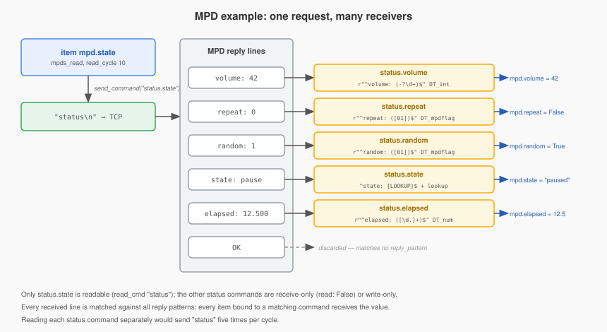

# Tutorial: vom Geräteprotokoll zur `commands.py` (MPD)

*English version: [`sdp_commands_tutorial.md`](sdp_commands_tutorial.md)*

Dieses Tutorial baut aus der Protokollbeschreibung des Music Player Daemon
(MPD) ein SDP-Plugin: welche Kommandos zu definieren sind, wie Antworten
zugeordnet werden, wo ein eigener Datentyp nötig ist und wie das Ergebnis
getestet wird. Das fertige Plugin liegt in [`example_mpd/`](example_mpd/),
seine Tests laufen auf dem echten SDP-Stack:

```bash
pytest doc/dev/sdp/example_mpd/tests
```

Hintergrund: [`sdp_plugin_guide.de.md`](sdp_plugin_guide.de.md) (Referenz),
[`sdp_architecture.md`](sdp_architecture.md) (Interna, englisch).

## Wahl des Beispiels

Kandidaten unter den Plugins, die nicht auf SDP basieren:

| Plugin | Umfang | Protokoll | Urteil |
|---|---|---|---|
| `yamahayxc` | 3447 Zeilen | HTTP + UDP-Events, viele Hosts pro Instanz, Browse/Queue/Playlist-Verwaltung, Feature-Erkennung pro Host | nicht einfach: SDP ist eine Verbindung pro Instanz; der Kern Zone/Power/Lautstärke passte auf `CONN_NET_UDP_SRV`, der Rest bliebe eigener Code |
| `nut` | 84 Zeilen | NUT-Textprotokoll | am einfachsten, aber nur lesend — keine Schreibvorgänge, Lookups oder Prüfungen zum Zeigen. (Es importiert `telnetlib`, das Python 3.13 entfernt hat.) |
| `jvcproj` | 408 Zeilen | binär mit Handshake | braucht eine eigene Protokollklasse — fortgeschrittenes Thema |
| `mpd` | 640 Zeilen | zeilenbasierter Text über TCP | Lesen und Schreiben, mehrzeilige Antworten, Flags, Aufzählungen, Wertebereiche, Aktionen — gewählt |

Quellen für die Protokollangaben unten sind der Code des `mpd`-Plugins
(`plugins/mpd/__init__.py`) und die MPD-Protokolldokumentation
(https://mpd.readthedocs.io/en/latest/protocol.html). Das Beispiel deckt einen
Teil davon ab.

## Schritt 1: das Protokoll auf der Leitung verstehen

- TCP, Port 6600, dauerhafte Verbindung. Beim Verbinden sendet MPD
  `OK MPD <version>`.
- Eine Anfrage ist eine Zeile mit `\n` am Ende.
- Eine Antwort ist ein Block aus Zeilen `schlüssel: wert`, abgeschlossen durch
  eine Zeile `OK`; ein Fehler ist eine einzelne Zeile
  `ACK [error@command_listNum] {command} message`.

```
> status
< volume: 42
< repeat: 0
< random: 1
< state: pause
< elapsed: 12.500
< OK
> setvol 50
< OK
```

Die zwei Tatsachen, die die ganze `commands.py` prägen:

1. **Eine Anfrage liefert viele Werte.** `status` beantwortet Lautstärke,
   Flags, Zustand und Spielzeit auf einmal; `currentsong` Titel, Interpret,
   Album.
2. **Schreiben sind eigene Verben** (`setvol 50`, `random 1`, `pause 1`,
   `next`), deren Antwort nur `OK` ist; der neue Wert erscheint im nächsten
   `status`.

## Schritt 2: Bestandsaufnahme

Auflisten, was als Item gewünscht ist, wie es gelesen und wie es geschrieben
wird:

| Item | Lesen über | Antwortzeile | Schreiben | Typ |
|---|---|---|---|---|
| state | `status` | `state: play\|pause\|stop` | — | str |
| volume | `status` | `volume: 42` | `setvol <0..100>` | num |
| random, repeat | `status` | `random: 0\|1` | `random 0\|1` | bool |
| elapsed | `status` | `elapsed: 12.500` | — | num |
| title, artist, album | `currentsong` | `Title: …`, `Artist: …`, `Album: …` | — | str |
| pause | — | — | `pause 0\|1` | bool |
| play, stop, next, previous | — | — | `play`, `stop`, … | bool (Trigger) |

## Schritt 3: Transport, Kommandoklasse, Plugin-Klasse

- Dauerhaftes TCP, Antworten kommen asynchron → `CONN_NET_TCP_CLI`. Der
  TCP-Client teilt den Datenstrom am Terminator und liefert eine Zeile pro
  Aufruf.
- Zeilen enden mit `\n` → `LINE_TERMINATED = True` und ein Parameter
  `terminator` mit Standardwert `"\n"`.
- Werte müssen aus Zeilen `schlüssel: wert` herausgeschnitten werden →
  `SDPCommandParseStr` (eine Capture-Gruppe in `reply_pattern` = der Wert).

```python
class MpdSdp(SmartDevicePlugin):
    PLUGIN_VERSION = '0.1.0'
    ALLOW_MULTIINSTANCE = True

    TRANSPORTS = (TransportRule(CONN_NET_TCP_CLI, requires='host'),)
    COMMAND_CLASS = SDPCommandParseStr
    LINE_TERMINATED = True
```

## Schritt 4: eine mehrzeilige Antwort verteilen



Bei einem asynchronen Transport weiß SDP nicht, auf welche Anfrage eine Zeile
antwortet. Es prüft jede empfangene Zeile gegen das `reply_pattern` jedes
Kommandos, und jeder Treffer erhält die Zeile. Daraus folgt der Entwurf:

- **ein lesbares Kommando pro Anfrage** — es sendet `status` und ist für eine
  Zeile des Blocks zuständig;
- **reine Empfangs- oder Schreibkommandos für die übrigen Zeilen** — sie
  senden `status` nie selbst, sie erkennen nur ihre Zeile.

```python
'status': {
    'state': {
        'read': True,
        'write': False,
        'read_cmd': 'status',
        'item_type': 'str',
        'dev_datatype': 'str',
        'reply_pattern': r'^state: {LOOKUP}$',
        'lookup': 'STATE',
        'item_attrs': {'initial': True, 'cycle': 10},
    },
    'elapsed': {
        'read': False,
        'write': False,
        'item_type': 'num',
        'dev_datatype': 'num',
        'reply_pattern': r'^elapsed: ([\d.]+)$',
    },
    ...
}
```

Warum nicht `read: True, read_cmd: 'status'` bei jedem Status-Kommando? Es
würde funktionieren, aber initiales, zyklisches und Gruppenlesen senden jedes
lesbare Kommando einmal: fünf lesbare Status-Kommandos bedeuten fünf
identische `status`-Anfragen pro Zyklus. Items an einem nicht lesbaren
Kommando erhalten trotzdem dessen Werte (Lese-/Schreibmodell, Leitfaden
Abschnitt 10); es geht also nichts verloren.

`{LOOKUP}` wird durch `(play|pause|stop)` ersetzt — die Schlüssel der Tabelle
`STATE` —, das Muster passt also nur auf bekannte Zustände und enthält die
Capture-Gruppe. Der Wert läuft danach durch das Vorwärts-Lookup:

```python
lookups = {'STATE': {'play': 'playing', 'pause': 'paused', 'stop': 'stopped'}}
```

Jedes Muster verankern (`^…$`). MPDs `currentsong` sendet `Time:`, `status`
dagegen `time:`; verankerte Muster mit Beachtung der Groß-/Kleinschreibung
halten sie auseinander.

Zeilen, auf die nichts passt (`OK`, der Gruß `OK MPD …`, `file: …`), werden
verworfen.

## Schritt 5: Schreiben und Wertprüfungen

```python
'volume': {
    'read': False,
    'write': True,
    'write_cmd': 'setvol {VALUE}',
    'item_type': 'num',
    'dev_datatype': 'int',
    'reply_pattern': r'^volume: (-?\d+)$',
    'cmd_settings': {'force_min': 0, 'force_max': 100},
},
```

- `{VALUE}` wird durch den vom Datentyp umgewandelten Item-Wert ersetzt:
  `DT_int` macht aus `50.0` den Wert `50`.
- `force_max: 100` begrenzt: Ein auf 150 gesetztes Item sendet `setvol 100`.
  Mit `valid_max` würde der Schreibvorgang stattdessen abgelehnt und das Item
  zurückgesetzt.
- `write_cmd` statt `opcode`: Das Kommando hat keine Leseform, und der
  Struct-Generator vergibt Lesegruppen nur an Kommandos mit `opcode` oder
  `read_cmd`.
- Über das `reply_pattern` folgt das Item `volume` den `status`-Antworten,
  obwohl das Kommando nicht lesbar ist. (`-?`, weil MPD `volume: -1` meldet,
  wenn es keinen Mixer hat.)

## Schritt 6: ein Datentyp für Flags

MPD sendet Flags als `0`/`1`. `DT_bool` nutzt Pythons Wahrheitswert, und der
String `'0'` ist wahr — `random: 0` würde das Item auf `True` setzen. Auch das
Senden stimmt nicht: `str(True)` ergibt `random True`. Ein dreizeiliger
Datentyp in `example_mpd/datatypes.py` behebt beide Richtungen:

```python
class DT_mpdflag(DT.Datatype):
    """MPD flag: ``1``/``0`` on the wire, bool in shng."""

    def get_send_data(self, data, **kwargs):
        return 1 if data else 0

    def get_shng_data(self, data, type=None, **kwargs):
        if type is None:
            return data == '1'
        return super().get_shng_data(data, type)
```

Referenziert als `'dev_datatype': 'mpdflag'` (ohne `DT_`):

```python
'random': {
    'read': False,
    'write': True,
    'write_cmd': 'random {VALUE}',
    'item_type': 'bool',
    'dev_datatype': 'mpdflag',
    'reply_pattern': r'^random: ([01])$',
},
```

`control.pause` nutzt ihn ebenfalls: `pause 1` pausiert, `pause 0` setzt fort.

## Schritt 7: Aktionen

`play`, `stop`, `next`, `previous` tragen keinen Wert. Als bool-Items mit
`enforce_updates` löst jedes Setzen das Kommando aus — auch das Setzen von
`False`. Ein Hook beschränkt sie auf wahre Werte:

```python
ACTIONS = ('control.play', 'control.stop', 'control.next', 'control.previous')

def _do_before_send(self, command, value, kwargs):
    """Drop falsy writes to action commands."""
    if command in self.ACTIONS and not value:
        return False, True
    return True, True
```

Die Rückgabe `(False, True)` beendet `send_command()` erfolgreich, das Item
wird also nicht zurückgesetzt. Aktionen haben `read: False`: Lesen aller
Kommandos (`x_read_group_trigger: 0`) oder initiales Lesen sendet sie nie.

## Schritt 8: Fehler vom Gerät

`ACK …`-Zeilen passen auf kein Muster und würden kommentarlos verschwinden.
Der Empfangs-Hook sieht jede Zeile zuerst:

```python
def _transform_received_data(self, data):
    """Log MPD error lines; they match no reply_pattern and are discarded afterwards."""
    if isinstance(data, str) and data.startswith('ACK'):
        self.logger.warning(f'MPD reports error: {data}')
    return data
```

## Schritt 9: plugin.yaml

Was SDP aus `example_mpd/plugin.yaml` braucht:

```yaml
plugin:
    sdp_minversion: '2.0.0'
    classname: MpdSdp
parameters:
    host:        {type: str, mandatory: true}
    port:        {type: int, default: 6600}
    terminator:  {type: str, default: "\n"}     # doppelte Anführungszeichen: echter Zeilenumbruch
    resume_initial_read: {type: bool, default: true}
    ...
item_attributes:
    mpds_command: ...
    mpds_read: ...
    mpds_write: ...
    mpds_read_group: ...
    mpds_read_cycle: ...
    mpds_read_initial: ...
    mpds_read_group_trigger: ...
    mpds_lookup: ...
```

`resume_initial_read: true` liest nach jedem Reconnect alle Werte neu. Das
Präfix `mpds_` vermeidet eine Kollision mit `mpd_command` des bestehenden
`mpd`-Plugins.

## Schritt 10: Item-Structs erzeugen

```bash
python doc/dev/sdp/example_mpd/__init__.py -s
```

Ausschnitt aus dem Ergebnis in `plugin.yaml`:

```yaml
item_structs:
    status:
        read:
            type: bool
            enforce_updates: true
            mpds_read_group_trigger@instance: status
        state:
            type: str
            mpds_command@instance: status.state
            mpds_read@instance: true
            mpds_write@instance: false
            mpds_read_group@instance:
            -   status
            mpds_read_initial@instance: true
            mpds_read_cycle@instance: 10
        volume:
            type: num
            mpds_command@instance: status.volume
            mpds_read@instance: false
            mpds_write@instance: true
```

Nach dem Erzeugen stand beim `terminator` als Standardwert `|4+` mit einer
folgenden Leerzeile, was als `"\n\n\n"` geladen wird — jedes Kommando wäre mit
zwei zusätzlichen Leerzeilen gesendet worden. Der Wert wurde von Hand auf
`"\n"` zurückgesetzt (Leitfaden Abschnitt 14).

Item-Konfiguration für Anwender:

```yaml
wohnzimmer:
    mpd:
        status:
            struct: example_mpd.status
        song:
            struct: example_mpd.currentsong
        control:
            struct: example_mpd.control
```

Ein Unter-Item pro Struct: Jeder Struct hat ein eigenes Trigger-Item `read`;
mehrere Structs an einem Item würden zu einem zusammengeführt.

(Das Struct-Präfix ist der Plugin-Name: `plugin_name` aus `etc/plugin.yaml`,
sonst der letzte Teil von `class_path` — hier `example_mpd`.)

## Schritt 11: testen

`example_mpd/tests/test_mpd_example.py` lädt das Plugin mit
`load_sdp_plugin()` über den echten Plugin-Loader, ersetzt den TCP-Client
durch eine `RecordingConnection` und speist Gerätezeilen so ein, wie es der
TCP-Client täte:

```python
def receive(self, *lines: str) -> None:
    for line in lines:
        self.plugin.on_data_received('127.0.0.1', line)

def test_status_block_fills_all_status_items(self):
    self.receive('volume: 42', 'repeat: 0', 'random: 1', 'state: pause', 'elapsed: 12.5', 'OK')

    self.assertEqual(42, self.rig.item('mpd.volume')())
    self.assertIs(True, self.rig.item('mpd.random')())
    self.assertEqual('paused', self.rig.item('mpd.state')())
    self.assertEqual(12.5, self.rig.item('mpd.elapsed')())

def test_volume_write_is_clamped(self):
    self.rig.item('mpd.volume')(150, 'test')

    self.assertEqual(['setvol 100\n'], self.rig.connection.payloads)
```

Die Testsuite prüft außerdem: Initiales Lesen sendet genau `status\n` und
`currentsong\n`; `random: 0` ergibt `False`; Aktionen laufen nur bei `True`;
reine Empfangskommandos werden nie angefordert; `ACK`-Zeilen werden geloggt
und ändern nichts; aus dem erzeugten `ALL`-Struct gebaute Items funktionieren
(`items_yaml_from_struct()` — der Test-Harness löst `struct:` nicht selbst
auf); ohne `host` lädt das Plugin nicht; und die Prüfungen von
`SdpPluginContractTest` bestehen.

## Ergebnis

| Datei | Zeilen (inkl. Docstrings) | Inhalt |
|---|---|---|
| `__init__.py` | 74 | Lizenzkopf, Standalone-Boilerplate, 3 Deklarationen, 2 kleine Hooks |
| `commands.py` | 121 | 13 Kommandos, 1 Lookup |
| `datatypes.py` | 17 | `DT_mpdflag` |

Zum Vergleich: `plugins/mpd/__init__.py` hat 640 Zeilen für einen größeren
Kommandoumfang, mit eigener Verbindungsverwaltung, Antwortauswertung und
Abfragezyklus.

## Mögliche nächste Schritte

- `currentsong` liefert nur `OK`, wenn nichts in der Warteschlange ist;
  Titel/Interpret/Album behalten dann ihre alten Werte.
  `_process_additional_data()` auf `status.state` könnte sie über
  `self._dispatch_callback()` leeren, wenn der Zustand `stopped` ist.
- MPDs Kommando `idle` meldet Änderungen ohne Abfragen; dafür muss `idle`
  nach jeder Meldung erneut gesendet werden (z. B. in
  `_process_additional_data()`) und vor anderen Anfragen mit `noidle`
  unterbrochen werden (`_do_before_send()`).
- Weitere `status`-Felder (`consume`, `single`, `xfade`, `bitrate`, …) und
  `stats` folgen demselben Muster wie die Schritte 4–6.
