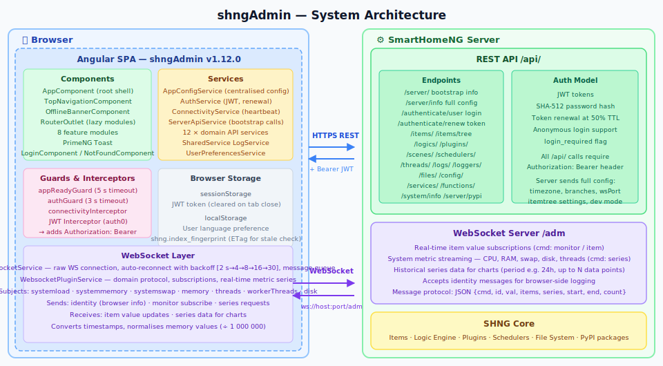
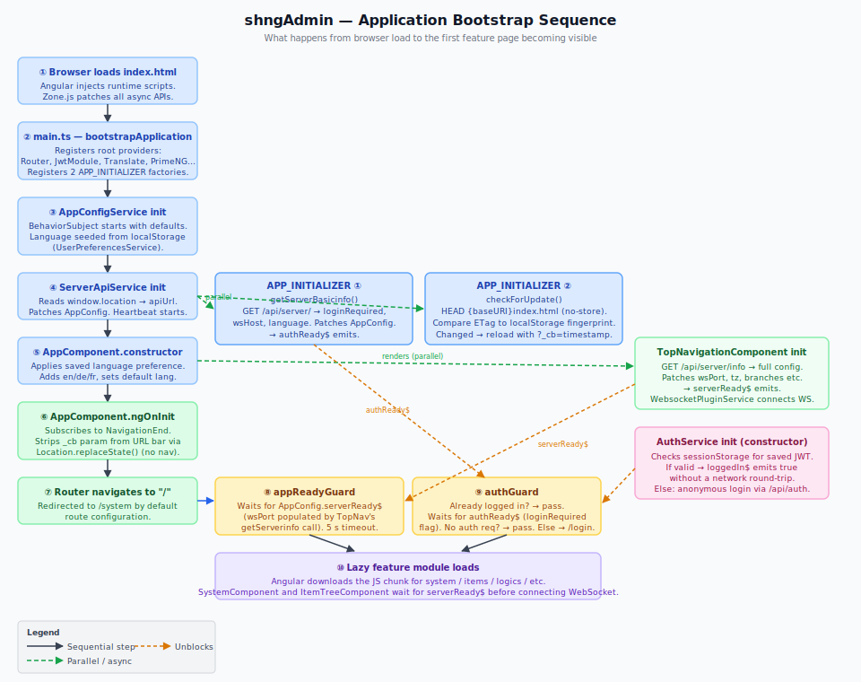
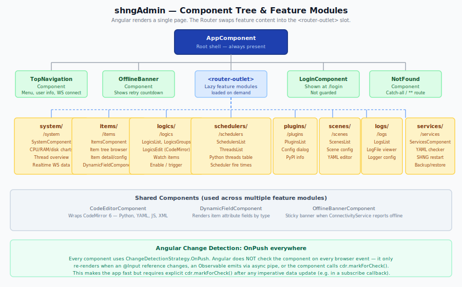
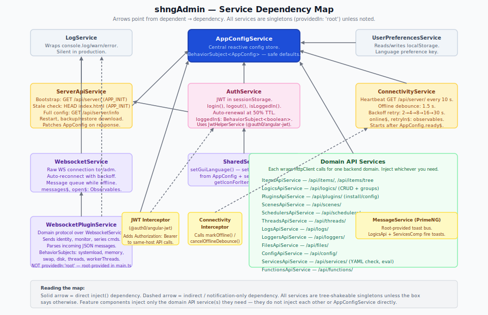
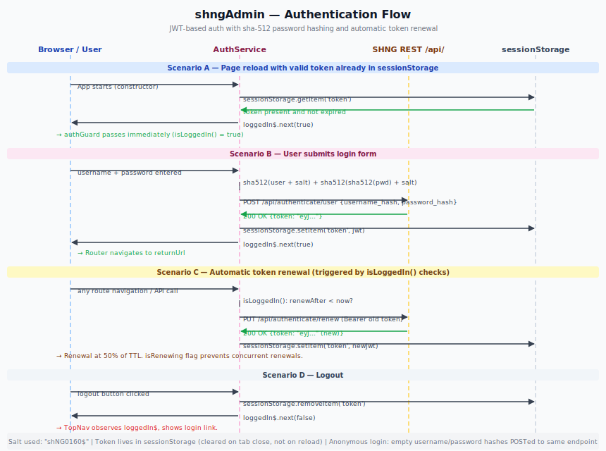
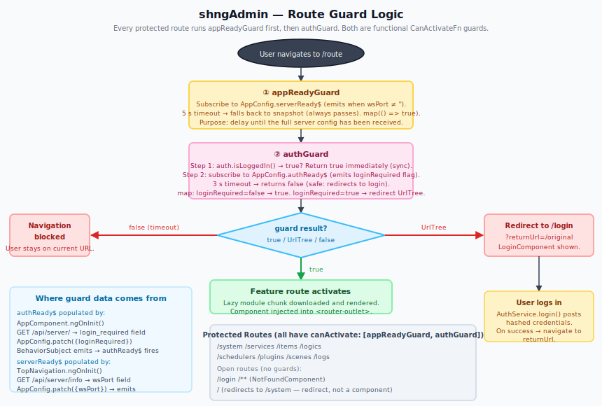
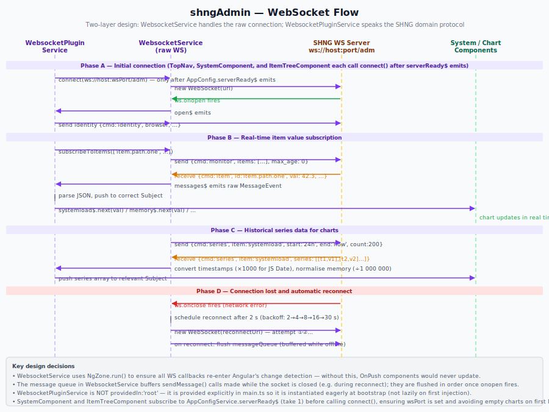
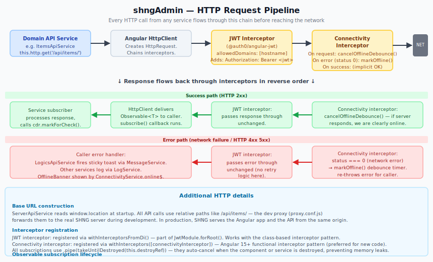

# shngAdmin — Architecture Guide

> **Audience**: A Python developer who understands how web applications work conceptually, but is new to Angular and TypeScript.  This guide assumes you can read code but do not yet know Angular idioms.
>
> **Goal**: By the end you should be able to navigate the codebase confidently, understand why things are structured the way they are, and make changes without breaking the parts you didn't touch.

---

## Table of Contents

1. [Big Picture](#1-big-picture)
2. [Technology Stack](#2-technology-stack)
3. [Application Bootstrap Sequence](#3-application-bootstrap-sequence)
4. [Angular Fundamentals (the 30-second version)](#4-angular-fundamentals-the-30-second-version)
5. [Component Tree](#5-component-tree)
6. [Service Layer](#6-service-layer)
7. [Authentication](#7-authentication)
8. [Route Guards](#8-route-guards)
9. [WebSocket Layer](#9-websocket-layer)
10. [HTTP Pipeline](#10-http-pipeline)
11. [Reactive State: Observables and BehaviorSubjects](#11-reactive-state-observables-and-behaviorsubjects)
12. [Change Detection: Why `markForCheck()` Matters](#12-change-detection-why-markforcheck-matters)
13. [Internationalisation (i18n)](#13-internationalisation-i18n)
14. [Feature Modules In Depth](#14-feature-modules-in-depth)
15. [Data Models](#15-data-models)
16. [Testing Approach](#16-testing-approach)
17. [Development Setup and Tooling](#17-development-setup-and-tooling)
18. [Where to Make Common Changes](#18-where-to-make-common-changes)

---

## 1. Big Picture

shngAdmin is a **Single-Page Application (SPA)** that runs entirely in the browser.  It is the administrative front-end for the [SmartHomeNG](https://www.smarthomeng.de/) home-automation server.

The server (written in Python) exposes two interfaces:
- A **REST API** at `/api/` for configuration reads and writes.
- A **WebSocket endpoint** at `/adm` for real-time metric streaming and item-value subscriptions.

The Angular app communicates with both, renders the results as interactive pages, and sends commands back (restart server, save a logic file, change a setting, etc.).

```
Browser                              SmartHomeNG Python server
  ┌──────────────────────┐              ┌────────────────────┐
  │  Angular SPA         │──HTTPS REST─▶│  REST API  /api/   │
  │  shngAdmin v1.12.0   │◀─────────────│                    │
  │                      │              │                    │
  │                      │◀─WebSocket──▶│  WS Server /adm    │
  └──────────────────────┘              └────────────────────┘
```

The full system architecture is shown in the first illustration:



---

## 2. Technology Stack

| Layer | Technology | Role |
|---|---|---|
| Language | TypeScript 5.8 | Compiled to JavaScript; adds static types |
| Framework | Angular 20 | Component framework, DI, routing, HTTP |
| UI components | PrimeNG 20 | Ready-made UI widgets (tables, dialogs, tabs…) |
| Icons | PrimeIcons + FontAwesome | Icon fonts |
| Charts | Chart.js 4 | Canvas-based graphs for system metrics |
| Code editing | CodeMirror 6 | Embedded editor (Python, YAML, JS, XML) |
| Translation | ngx-translate | Runtime language switching (en/de/fr) |
| Auth tokens | @auth0/angular-jwt | JWT decode, expiry check, HTTP interceptor |
| Hashing | js-sha512 | SHA-512 password hashing before sending |
| Testing | Jest 30 + jest-preset-angular | Unit tests; runs in Node (no browser needed) |
| Linting | ESLint + angular-eslint | Code quality |
| Formatting | Prettier | Consistent code style |
| Git hooks | Husky + lint-staged | Auto-format on commit |

**TypeScript vs Python**: TypeScript is structurally typed — the compiler checks that objects have the right fields and method signatures, but at runtime it is plain JavaScript.  Interfaces (like `ServerInfo`) are compile-time only; they vanish after compilation.

---

## 3. Application Bootstrap Sequence

"Bootstrap" here means everything that happens from the moment the browser downloads the page until the first feature screen is visible.



**Step by step:**

### 3.1 Browser loads `index.html`
Angular's build tool (`@angular/build`) produces a single `index.html` that references bundled JavaScript files.  The browser fetches and executes them.

`zone.js` is loaded first.  It patches *every* browser async API (`setTimeout`, `Promise`, `fetch`, XHR, WebSocket) so Angular can know when asynchronous work finishes and decide whether to update the UI.  Think of Zone.js as a Python `contextvars` that propagates through all async boundaries.

### 3.2 `main.ts` — `bootstrapApplication`
This is the entry point, equivalent to Python's `if __name__ == '__main__'`.  It calls `bootstrapApplication(AppComponent, providers)` which:
- Creates Angular's **dependency-injection container** (called the "injector").  Think of it as a dict that maps class names to singleton instances.
- Registers all **root-level providers**: the Router, translation service, JWT module, PrimeNG theme, HTTP client, and a few singleton services.
- Renders `AppComponent` into the `<app-root>` element in `index.html`.

### 3.3 Singleton services instantiate
Before any component runs, Angular creates all root-provided services.  The important ones for startup:

**`AppConfigService`** — creates a `BehaviorSubject<AppConfig>` seeded with safe defaults.  Language is pre-populated from `localStorage` so the UI renders in the right language even before the server responds.

**`ServerApiService`** (constructor) — reads `window.location` to build the `apiUrl` string (e.g. `http://192.168.1.10:8383/api/`), and patches this into `AppConfigService`.  At this point the app knows where the server is.  The service also provides the two `APP_INITIALIZER` factory functions: `getServerBasicinfo()` and `checkForUpdate()` (see 3.4 below).

**`ConnectivityService`** (constructor) — waits for `AppConfig.ready$` (emits once `apiUrl` is set), then starts the heartbeat timer.

**`AuthService`** (constructor) — checks `sessionStorage` for a saved JWT token.  If found and not expired, marks the user as logged in immediately, without a network round-trip.

### 3.4 `APP_INITIALIZER` factories run in parallel
`main.ts` registers two `APP_INITIALIZER` factories that Angular runs concurrently before rendering anything:

**`getServerBasicinfo()`** — `GET /api/server/` — fetches the minimal bootstrap info.  The response patches `loginRequired`, `wsHost`, and language defaults into `AppConfigService`.  Once `loginRequired` is set, `authReady$` emits, which is the signal `authGuard` is waiting for.

**`checkForUpdate()`** — makes a `HEAD {document.baseURI}index.html` request with `cache: 'no-store'` to read the server's `ETag` or `Last-Modified` fingerprint.  Compares it to the value stored in `localStorage` under `shng.index_fingerprint`.  If the fingerprint has changed (meaning a new build was deployed), it calls `window.location.replace(url + '?_cb=<timestamp>')`, which forces the browser to bypass its cache and reload the latest bundle.  Using `document.baseURI` instead of a hard-coded `/index.html` makes this work correctly under sub-path mounts (e.g. `/admin/`).

### 3.5 `AppComponent` renders
Angular creates the root component.  Its constructor sets the translation language.  Its `ngOnInit()` subscribes to the Router's `NavigationEnd` event to silently strip the `_cb` cache-busting query parameter from the URL bar after a stale-frontend reload, using `Location.replaceState()` so no secondary navigation occurs.

### 3.6 `TopNavigationComponent` renders (in parallel)
The navigation bar is part of `AppComponent`'s template, so it renders at the same time as `AppComponent`.  Its `ngOnInit()` fires:

```
GET /api/server/info   →   full config  { wsPort, tz, branches, itemtree settings, … }
```

The response patches all those values into `AppConfigService`.  Critically, once `wsPort` is set, `serverReady$` emits, which unblocks `appReadyGuard`.

`TopNavigationComponent` also calls `WebsocketPluginService.connect()` at this point.

### 3.7 Router activates the first route
The Router tries to activate `/system` (the default redirect from `/`).  It runs the guards first:
1. `appReadyGuard` — waits for `serverReady$`.
2. `authGuard` — checks login state / `authReady$`.

Once both pass, Angular downloads the `system` feature chunk and renders the system dashboard.

---

## 4. Angular Fundamentals (the 30-second version)

### Components
A **component** is a Python class with a decorator that links it to an HTML template and a CSS file.  When Angular renders the component, it evaluates the template (data binding, loops, conditionals) and produces DOM nodes.

```typescript
@Component({
  selector: 'app-items',       // use as <app-items> in HTML
  templateUrl: './items.component.html',
  styleUrls: ['./items.component.css'],
  changeDetection: ChangeDetectionStrategy.OnPush,
  imports: [CommonModule, FormsModule, ...],  // what this component uses
})
export class ItemsComponent implements OnInit {
  items: Item[] = [];
  private readonly apiService = inject(ItemsApiService);  // DI: get singleton

  ngOnInit() {  // called once after the component is created
    this.apiService.getItems().subscribe(items => {
      this.items = items;
      this.cdr.markForCheck();  // tell Angular to re-render
    });
  }
}
```

### Dependency Injection
`inject(SomeService)` is how you get singletons.  Angular's injector creates `SomeService` once and hands the same instance to every class that asks for it.  This is the same concept as Python's dependency-injection containers (e.g. `dependency-injector`), but built into the framework.

### Observables
RxJS Observables are Angular's primary tool for async data, similar to Python's `asyncio` coroutines but push-based.  An Observable emits values over time; you subscribe to receive them.  A `BehaviorSubject` is an Observable that also remembers its last value and emits it immediately to new subscribers.

### Templates
Angular templates are HTML with extra syntax:
- `{{ value }}` — interpolation (like Python f-strings)
- `[property]="expr"` — property binding (one-way, component → DOM)
- `(event)="handler()"` — event binding (DOM → component)
- `*ngFor="let item of items"` — structural directive (looping)
- `*ngIf="condition"` — conditional rendering

---

## 5. Component Tree

The app renders a fixed shell (AppComponent) with a slot (`<router-outlet>`) where the current page's content is swapped in.



### Root shell (`AppComponent`)
Always present.  Contains:
- `<app-top-navigation>` — the menu bar
- `<app-offline-banner>` — shown when connectivity is lost
- `<router-outlet>` — where the current page renders
- `<p-toast position="bottom-right">` — PrimeNG toast notification layer

### `TopNavigationComponent`
Renders the horizontal navigation tabs.  On init, fetches the full server info and connects the WebSocket.  Subscribes to `AuthService.loggedIn$` to show/hide the login link.  Displays the connected-server hostname.

### `OfflineBannerComponent`
Subscribes to `ConnectivityService.online$` and `ConnectivityService.retryIn$`.  When `online$` emits `false`, shows a sticky banner at the top with a countdown to the next reconnect attempt.  Provides a "Retry now" button.

### Feature modules
Each area of the admin UI is a separate **lazy-loaded module**.  Angular downloads the JavaScript for that module only when the user navigates to the route for the first time.  This keeps the initial page load small.

| Route | Module | What it does |
|---|---|---|
| `/system` | system/ | CPU/RAM/swap/disk/thread charts using WebSocket real-time data |
| `/items` | items/ | Browse the item tree, view/edit item attributes and values |
| `/logics` | logics/ | List, create, edit, enable/trigger Python logic scripts |
| `/schedulers` | schedulers/ | View scheduler fire times and Python thread list |
| `/plugins` | plugins/ | Browse installed plugins, view/edit config, check PyPI |
| `/scenes` | scenes/ | View and configure scenes (automated sequences) |
| `/logs` | logs/ | View log files and configure log levels |
| `/services` | services/ | YAML checker, eval tester, SHNG restart, backup/restore |

### Shared components
Located in `src/app/common/components/`:

**`CodeEditorComponent`** — wraps CodeMirror 6.  Used in logics editing, YAML checker, and anywhere the user needs to edit code.  Supports Python, YAML, JavaScript, and XML syntax highlighting.

**`DynamicFieldComponent`** — used in the items detail view.  SHNG items can have many different attribute types (number, bool, string, list, dict).  This component renders the appropriate input widget based on the attribute's type metadata.

---

## 6. Service Layer

Services are singleton objects that handle data fetching, state management, and cross-cutting concerns.  They are created once by the DI container and shared across all components.



### 6.1 `AppConfigService` — the configuration hub

`src/app/common/services/app-config.service.ts`

This service is the **single source of truth for all runtime configuration**.  It replaces the previous pattern of scattering config values across `sessionStorage` keys.

It holds an `AppConfig` object inside a `BehaviorSubject`.  Any part of the app can read the current snapshot synchronously, or subscribe reactively to be notified when it changes.

```typescript
// Synchronous read (use when you just need the current value)
const wsPort = this.appConfig.wsPort;

// Reactive read (use when you need to react to future changes)
this.appConfig.config$.subscribe(cfg => { ... });

// Wait until a specific condition is met
this.appConfig.serverReady$.pipe(take(1)).subscribe(() => {
  // full config is now available
});
```

**Key Observables on AppConfigService:**

| Observable | Emits when | Used by |
|---|---|---|
| `ready$` | `apiUrl` is set (ServerApiService ctor) | ConnectivityService |
| `serverReady$` | `wsPort` is set (after `/api/server/info`) | appReadyGuard, SystemComponent, ItemTreeComponent |
| `authReady$` | `loginRequired` is set (after `/api/server/`) | authGuard |
| `config$` | any `patch()` call | anything needing reactive config |

### 6.2 `ServerApiService`

`src/app/common/services/server-api.service.ts`

Handles all HTTP calls that are about the server itself (not a specific domain like items or logics):

- `getServerBasicinfo()` — `GET /api/server/` — minimal info for initial render; patches `loginRequired`.  Provided as an `APP_INITIALIZER` factory in `main.ts`.
- `checkForUpdate()` — `HEAD {baseURI}index.html` with `cache:'no-store'`; compares the server's `ETag`/`Last-Modified` fingerprint against the value in `localStorage`.  If changed, forces a cache-miss reload by redirecting to the current URL with a `_cb=<timestamp>` query parameter.  `AppComponent` silently strips the `_cb` parameter on `NavigationEnd` via `Location.replaceState()`.  Also provided as an `APP_INITIALIZER` factory and runs in parallel with `getServerBasicinfo()`.
- `getServerinfo()` — `GET /api/server/info` — full config; patches `wsPort`, `tz`, `branches`, etc.  Called by `TopNavigationComponent`.
- `getShngServerStatus()` — polls server status (used by ServicesComponent).
- `restartShngServer()` — sends restart command.
- `downloadConfigBackup()` / restore — backup ZIP download/upload.

The constructor reads `window.location` and calls `appConfig.patch({ apiUrl, hostIp, wsHost })`.

### 6.3 `AuthService`

`src/app/common/services/auth.service.ts`

Manages the JWT lifecycle.  See Section 7 for the full auth flow.

Key public API:
- `isLoggedIn()` — synchronous check; also triggers token renewal if `renewAfter < now`.
- `login(credentials)` — returns Observable\<boolean\>.
- `logout()` — clears token from memory and sessionStorage.
- `loggedIn$` — BehaviorSubject\<boolean\>; TopNav subscribes to update the UI.

### 6.4 `ConnectivityService`

`src/app/common/services/connectivity.service.ts`

Monitors whether the SHNG server is reachable.  Runs a silent heartbeat `GET /api/server/` every 10 seconds.  When a request fails (status 0 = network unreachable), it starts a debounce timer (1.5 s) before declaring the server offline, because a cancelled XHR (e.g. Angular destroying a component) also produces status 0.

On going offline: stops the heartbeat, starts an exponential-backoff retry sequence (2 → 4 → 8 → 16 → 30 seconds).  Publishes countdown ticks on `retryIn$`.

Public Observables:
- `online$` — `BehaviorSubject<boolean>`: OfflineBanner subscribes to show/hide.
- `retryIn$` — `BehaviorSubject<number>`: countdown in seconds shown in the banner.

### 6.5 `LogService`

`src/app/common/services/log.service.ts`

Wraps `console.log`, `console.warn`, and `console.error`.  In production builds, `log()` and `debug()` calls are silenced.  Always use `LogService` instead of `console.log` directly, so logs don't leak into production.

### 6.6 `SharedService`

`src/app/common/services/shared.service.ts`

A small utility service.  Primary responsibility: `setGuiLanguage()` — reads the fallback language order from `AppConfigService` and the server's preferred language from `ServerInfo`, then calls `TranslateService.use()` to switch the active language.  Also provides `getIconForItem()` — maps SHNG item types to icon names.

### 6.7 `UserPreferencesService`

`src/app/common/services/user-preferences.service.ts`

Reads and writes `localStorage`.  Currently only stores the user's language preference.  This is seeded into `AppConfigService` at startup so the language is correct before the server responds.

### 6.8 Domain API services

`src/app/common/services/*-api.service.ts`

There are 12 of these, one per backend domain.  They all follow the same pattern:

```typescript
@Injectable({ providedIn: 'root' })
export class ItemsApiService {
  private readonly http = inject(HttpClient);
  private readonly appConfig = inject(AppConfigService);

  getItems() {
    return this.http.get<Item[]>(this.appConfig.apiUrl + 'items/');
  }

  saveItem(id: string, value: unknown) {
    return this.http.put(this.appConfig.apiUrl + 'items/' + id, { value });
  }
}
```

Each service:
- Injects `HttpClient` (Angular's HTTP client).
- Reads `apiUrl` from `AppConfigService` to build URLs.
- Returns Observables — the caller subscribes and handles the data.
- Does NOT store state (no properties, no caching) — it only issues HTTP calls.

---

## 7. Authentication

shngAdmin uses **JWT (JSON Web Token)** authentication.



### 7.1 How JWT works

A JWT is a signed string that encodes claims (who you are, when it was issued, when it expires).  The browser stores it and sends it with every request.  The server verifies the signature using its secret key — no session table needed.

Token contents (decoded by `jwtHelper.decodeToken()`):
- `iat` — issued-at timestamp (Unix seconds)
- `exp` — expiry timestamp
- `name` — username (empty for anonymous)
- `admin` — boolean

### 7.2 Password hashing

Passwords are **never sent in plain text**.  Before the `POST /api/authenticate/user` request, `AuthService.login()` applies SHA-512 twice with a fixed salt:

```
username_hash = sha512(username + "shNG0160$")
password_hash = sha512(sha512(password) + "shNG0160$")
```

This prevents the raw password from appearing in network logs.

### 7.3 Token storage

The token lives in `sessionStorage` — it survives page reloads in the same tab (unlike `sessionStorage` in some frameworks) but is automatically cleared when the tab is closed.  This is a deliberate design choice: closing the browser tab acts as a logout.

### 7.4 Anonymous login

If SHNG is configured with `login_required: false`, the app performs an "anonymous login": a POST with empty hashed credentials.  The server still issues a JWT (anonymous is still a valid identity for the WebSocket `identity` message), so the same code path handles both cases.

### 7.5 Token renewal

`isLoggedIn()` is called on every route navigation and (indirectly) on API calls.  It checks whether `renewAfter < now` (where `renewAfter` is set to 50% of the token's TTL).  If so, it calls `renewToken()`, which does a `PUT /api/authenticate/renew` with the existing token in the `Authorization: Bearer` header.  The server returns a fresh token with a new `exp`.

An `isRenewing` flag prevents multiple concurrent renewal requests.

---

## 8. Route Guards

Guards are functions that run before a route is activated.  They can allow, redirect, or block navigation.



All 8 protected routes have:
```typescript
canActivate: [appReadyGuard, authGuard]
```

### 8.1 `appReadyGuard`

`src/app/common/guards/app-ready.guard.ts`

**Problem it solves**: Components like SystemComponent immediately call the API with WebSocket port numbers when they render.  If the server info hasn't arrived yet, these calls fail.

**How it works**: Subscribes to `AppConfigService.serverReady$` and waits for it to emit (meaning `wsPort` has been populated from `/api/server/info`).  5-second timeout — if the server hasn't responded in 5 seconds, falls back to the current snapshot and passes anyway (so a slow server never blocks navigation forever).

### 8.2 `authGuard`

`src/app/common/guards/auth.guard.ts`

**Problem it solves**: The app might start on a protected route with no token in sessionStorage.  We need to redirect to `/login`, but we need to know whether login is actually required (SHNG can run without auth).

**How it works**:
1. Fast path: if `auth.isLoggedIn()` returns `true`, pass immediately (no async needed).
2. Slow path: subscribe to `AppConfigService.authReady$` (waits for `loginRequired` flag from `/api/server/`).  3-second timeout for safety.
3. If `loginRequired === false`: pass (anonymous access allowed).
4. If `loginRequired === true` and not logged in: return a `UrlTree` for `/login?returnUrl=/original` — Angular redirects automatically.

The `returnUrl` query parameter is read by `LoginComponent` after successful login to navigate back to where the user was trying to go.

---

## 9. WebSocket Layer

The WebSocket connection provides two things:
1. **Real-time item value updates** — when a sensor value changes in SHNG, it is pushed to all subscribed browser clients.
2. **System metric streaming** — CPU load, memory, swap, disk I/O, thread counts — for the live charts on the System dashboard.



### 9.0 When components connect

`TopNavigationComponent` calls `WebsocketPluginService.connect()` once, after receiving the full server info from `/api/server/info` (which is also when `serverReady$` emits).

`SystemComponent` and `ItemTreeComponent` additionally need the WebSocket port before they can request series data and item subscriptions.  Both subscribe to `AppConfigService.serverReady$` with `take(1), takeUntilDestroyed(...)` in `ngOnInit()` and call `WebsocketPluginService.connect()` only after it emits.  This eliminates a race condition that previously caused the resource graphs on the System dashboard to be empty on first production load, because `wsPort` had not yet been populated when the components initialised.

### 9.1 `WebsocketService` — the raw transport

`src/app/common/services/websocket.service.ts`

Owns the `WebSocket` object.  Responsibilities:
- Connect to `ws://host:wsPort/adm`.
- Expose `messages$` (Subject\<MessageEvent\>) and `open$` (Subject\<void\>) as Observables.
- Queue outgoing messages while the socket is closed; flush them on reconnect.
- Auto-reconnect with exponential backoff: 2 → 4 → 8 → 16 → 30 seconds.
- Wrap all callbacks in `NgZone.run()` so Angular's change detection knows about them.

**Why NgZone?**  WebSocket callbacks are outside Angular's zone (they arrive from the browser's native WebSocket, which Zone.js doesn't automatically patch in this way).  Without `ngZone.run()`, `OnPush` components would never update when a message arrives, because Angular wouldn't know anything changed.

### 9.2 `WebsocketPluginService` — the domain protocol

`src/app/common/services/websocket-plugin.service.ts`

Understands the SHNG WebSocket message protocol.  It subscribes to `WebsocketService.messages$` and dispatches incoming JSON messages to the right `BehaviorSubject`.

**Connection flow on open:**
1. Sends an `identity` message: `{ cmd: 'identity', browser: '...', ... }` — SHNG uses this for its own logging.
2. Sends a `monitor` subscription for the standard system metrics.

**Outgoing message types:**

| cmd | Purpose |
|---|---|
| `identity` | Announce browser info to server |
| `monitor` | Subscribe to item value updates: `{ cmd: 'monitor', items: ['item.path', ...] }` |
| `item` | Set an item value: `{ cmd: 'item', id: 'item.path', val: 42 }` |
| `series` | Request historical data: `{ cmd: 'series', item: 'systemload', start: '24h', end: 'now', count: 200 }` |

**Incoming message types:**

| cmd | What it carries |
|---|---|
| `item` | Updated value for a subscribed item |
| `series` | Historical data array for a chart |

**Published BehaviorSubjects** (components subscribe to these):
- `systemload$`, `systemmemory$`, `systemswap$` — scalar values for live gauges
- `memory$`, `threads$`, `workerThreads$`, `disk$` — richer objects for detailed views

**Data normalisation**:
- Timestamps from the server are in seconds.  JavaScript `Date` objects use milliseconds.  The service multiplies timestamps by 1000.
- Memory values are in bytes from the server.  The service divides by 1,000,000 to display in MB.

### 9.3 Why two services?

`WebsocketService` only knows about raw WebSocket mechanics.  `WebsocketPluginService` only knows about SHNG's domain protocol.  This separation means you can test the protocol layer by feeding it fake `MessageEvent` objects without needing a real WebSocket connection.

---

## 10. HTTP Pipeline

Every HTTP request passes through a chain of interceptors before it reaches the network, and through the same chain (in reverse) on the way back.



### 10.1 JWT Interceptor (from `@auth0/angular-jwt`)

Automatically injects the `Authorization: Bearer <token>` header on every request whose URL matches an `allowedDomains` entry.  The domain is set to `window.location.hostname` — same-origin only — so tokens are never sent to third-party URLs (e.g. font CDNs).

The token comes from `AuthService.getToken()`.

### 10.2 Connectivity Interceptor

`src/app/common/interceptors/connectivity.interceptor.ts`

A **functional interceptor** (the newer Angular style):

```typescript
export const connectivityInterceptor: HttpInterceptorFn = (req, next) => {
  connectivity.cancelOfflineDebounce();  // a request is going out — we're probably online
  return next(req).pipe(
    catchError(err => {
      if (err.status === 0) {    // status 0 = network failure (not an HTTP error code)
        connectivity.markOffline();
      }
      return throwError(() => err);  // re-throw so the caller's error handler fires
    })
  );
};
```

The `cancelOfflineDebounce()` call handles a subtle case: Angular destroys a component (e.g. navigating away) which cancels any in-flight HTTP requests.  Those cancellations also produce status 0.  The debounce (1.5 s window) prevents this from falsely triggering the offline banner: if the *next* page's requests succeed, `cancelOfflineDebounce()` clears the timer and the banner never shows.

### 10.3 URL construction

API services don't hard-code host:port.  They read `appConfig.apiUrl` which is built from `window.location` at startup:

```
apiUrl = "http://" + window.location.hostname + ":" + window.location.port + "/api/"
```

In development, a proxy (`proxy.conf.js`) forwards `/api/` and `/admin/` requests from `localhost:4200` to the real SHNG server.  In production, SHNG serves the Angular app at the same origin, so no proxy is needed.

---

## 11. Reactive State: Observables and BehaviorSubjects

RxJS Observables are central to how Angular services and components communicate.  If you are coming from Python, the closest mental model is:

| Python | Angular/RxJS |
|---|---|
| `asyncio.Queue` | `Subject` |
| `asyncio.Queue` with last-value memory | `BehaviorSubject` |
| `async for item in queue` | `.subscribe(item => ...)` |
| `asyncio.gather(...)` | `forkJoin(...)` / `combineLatest(...)` |
| `async with resource` | `takeUntilDestroyed(destroyRef)` |

### Subscription lifecycle

**The most common bug**: subscribing to an Observable inside a component and forgetting to unsubscribe.  The component is destroyed (user navigates away), but the callback keeps running and trying to update a destroyed view.

The fix used throughout this codebase:

```typescript
export class MyComponent {
  private readonly destroyRef = inject(DestroyRef);

  ngOnInit() {
    this.someService.data$
      .pipe(takeUntilDestroyed(this.destroyRef))
      .subscribe(data => {
        this.data = data;
        this.cdr.markForCheck();
      });
  }
}
```

`takeUntilDestroyed(this.destroyRef)` automatically unsubscribes when the component is destroyed — no manual `ngOnDestroy` needed.

### The `async` pipe alternative

Templates can subscribe directly using Angular's `async` pipe:

```html
<div *ngIf="data$ | async as data">{{ data.value }}</div>
```

This auto-unsubscribes when the component is destroyed.  However, it only works in templates and forces an `OnPush` re-render on every emission.

---

## 12. Change Detection: Why `markForCheck()` Matters

Angular optimises rendering by only checking components when something might have changed.  All components in this app use `ChangeDetectionStrategy.OnPush`.

**What OnPush means**: Angular will NOT re-render the component unless:
1. An `@Input()` binding reference changes.
2. An Observable used via the `async` pipe emits.
3. The component explicitly calls `this.cdr.markForCheck()`.
4. An event handler on this component fires.

**Why you see `cdr.markForCheck()` everywhere**: All HTTP subscription callbacks are imperative (not via `async` pipe).  When data arrives and you set `this.items = response`, Angular doesn't know about it.  You must call `this.cdr.markForCheck()` to schedule a re-render.

```typescript
// ✓ Correct
this.api.getItems().subscribe(items => {
  this.items = items;
  this.cdr.markForCheck();  // essential — without this, the template doesn't update
});

// ✗ Wrong — template will never show the new data
this.api.getItems().subscribe(items => {
  this.items = items;
});
```

---

## 13. Internationalisation (i18n)

Translation is handled by `@ngx-translate`.  Translation files are JSON files in `src/assets/i18n/`:

- `en.json` — English (default)
- `de.json` — German
- `fr.json` — French
- `da.json`, `fi.json`, `nb.json`, `nl.json`, `sv.json` — partial Scandinavian/Dutch translations

### Language selection cascade

1. Check `localStorage` for a saved user preference (set via Services page).
2. If no preference, ask the server for its configured `default_language`.
3. If the server language is not supported, fall back using `fallbackLanguageOrder` (default: `['en', 'de']`).

### Using translations in code

In templates:
```html
<h2>{{ 'ITEMS.TITLE' | translate }}</h2>
<button>{{ 'COMMON.SAVE' | translate }}</button>
```

In component code:
```typescript
const label = this.translate.instant('ITEMS.SEARCH_PLACEHOLDER');
```

### Adding/updating translations

1. Add the key to `en.json` (and other language files).
2. Use the key in templates or components.
3. Run `npm run i18n:extract` to scan the source and update all JSON files with missing keys.

---

## 14. Feature Modules In Depth

### System (`src/app/system/`)
Displays real-time charts for CPU load, memory, swap, disk, and threads.  Data comes from `WebsocketPluginService` BehaviorSubjects.  The component subscribes to `AppConfigService.serverReady$` before connecting, then feeds the data into Chart.js instances.

The system overview also shows the frontend version in the same format as ShNG core and plugins: `v1.12.0-c9fbffb.work   in   /path/to/shngadmin   (heads/work)`.  This string is assembled at build time by `scripts/generate-version.js`, which runs automatically via npm `prebuild`/`prestart`/`postinstall` hooks and writes `src/app/git-version.auto.ts` (listed in `.gitignore`).  The generated file exports `GIT_COMMIT`, `GIT_BRANCH`, `GIT_REF`, and `BUILD_PATH`.  `app.component.ts` re-exports these as `APP_VERSION_DETAIL`, `APP_VERSION_REF`, and `APP_BUILD_PATH` for use in the system properties table.  The `postinstall` hook creates the file after `npm install` so fresh clones always have it before the first build.

### Items (`src/app/items/`)
The item tree is the core of SHNG — items are variables that represent sensor readings, actuator states, and computed values.  The items module shows a hierarchical tree (fetched from `/api/items/tree`), lets you drill into individual items, and uses `DynamicFieldComponent` to render editable attributes.

### Logics (`src/app/logics/`)
Logics are Python scripts that run inside SHNG.  This module has:
- A list view with enable/disable toggles.  The "grouped" vs "flat" display mode is persisted in `localStorage` so the user's preference survives page reloads.
- A groups view for organising logics.  Group membership is reliably reflected immediately after saving.
- A full-screen CodeMirror editor for editing logic source code.
- Save failures fire sticky PrimeNG toast notifications via `MessageService`.
- All 8 add-item / add-group / add-logic / add-logger / add-plugin dialogs support Enter to confirm and Escape to cancel.

### Plugins (`src/app/plugins/`)
Shows installed SHNG plugins, their configuration, and PyPI package information.  The configuration editor uses `DynamicFieldComponent` for the same reason as items — plugin parameters can be of many types.

### Logs (`src/app/logs/`)
The log viewer auto-scrolls to the bottom when a new log file or time-frame is selected (initial load, log switch, fast-forward to newest chunk).  Both the logger-level picker in `logger-line.component` and the filter dropdown in `log-display.component` include the `DEVELOP` level (numeric value 9, below `DEBUG=10`), which is used by some SHNG plugins via `logger.develop()`.

### Services (`src/app/services/`)
A catch-all admin page with:
- YAML syntax checker and converter.
- Python `eval` expression tester.
- SHNG status display with live polling (every 5 s when running, every 1 s while restarting).
- Restart button.
- Password hash generator (sha-512 for use in SHNG's `etc/smarthome.yaml`).
- Config backup download and restore upload.
- Cache orphan file management.

---

## 15. Data Models

TypeScript interfaces in `src/app/common/models/` define the shape of server responses.  They have no runtime presence — they exist only to help the compiler catch typos.

Key models:

**`ServerInfo`** (`server-info.ts`):
```typescript
interface ServerInfo {
  login_required: boolean;
  backup_stem: string | null;
  // ... timezone, branches, wsPort, itemtree settings
}
```

**`ItemDetails`** (`item-details.ts`): Full item object with `type`, `value`, `enforce_updates`, `eval`, `cron`, `cycle`, etc.

**`LogicsInfo`** (`logics-info.ts`): Logic metadata — `name`, `enabled`, `logictype`, `watch_item`, etc.

**`PluginInfo`** (`plugin-info.ts`): Plugin metadata, configuration schema, runtime status.

**`AppConfig`** (`app-config.service.ts` — not a model file): The internal config shape — see Section 6.1.

---

## 16. Testing Approach

Tests use **Jest** (not Karma/Jasmine).  Jest runs in Node.js with a DOM simulation (`jest-environment-jsdom`), so tests are fast — no browser required.

Test files sit next to the source files: `items.component.spec.ts` is in the same directory as `items.component.ts`.

### Test helper (`src/testing/test-helpers.ts`)
Provides mock factory functions so you don't repeat boilerplate in every spec:

```typescript
const mockAuth = createMockAuthService({ isLoggedIn: true });
const mockConfig = createMockAppConfigService({ wsPort: '2121' });
```

### Typical component test structure
```typescript
describe('ItemsComponent', () => {
  let component: ItemsComponent;
  let fixture: ComponentFixture<ItemsComponent>;

  beforeEach(() => {
    TestBed.configureTestingModule({
      imports: [ItemsComponent],
      providers: [
        { provide: AuthService, useValue: createMockAuthService() },
        { provide: ItemsApiService, useValue: { getItems: () => of([]) } },
      ],
    });
    fixture = TestBed.createComponent(ItemsComponent);
    component = fixture.componentInstance;
    fixture.detectChanges();
  });

  it('should load items on init', () => {
    expect(component.items).toEqual([]);
  });
});
```

### Running tests
```bash
npm test              # run all tests once
npm run test:watch    # re-run on file changes (fast feedback loop)
npm run test:coverage # with coverage report
```

---

## 17. Development Setup and Tooling

### Prerequisites
- Node.js 20+
- npm

### Install and run
```bash
npm install          # install all dependencies
npm start            # start dev server at http://localhost:4200
```

### Proxy configuration
`proxy.conf.js` forwards API calls from the dev server to your SHNG instance.  Edit the `PROXY_TARGET` constant at the top:

```javascript
const PROXY_TARGET = 'http://192.168.1.10:8383';  // your SHNG address
```

The `secure: false` setting disables TLS certificate verification (necessary for self-signed certs on local SHNG instances).  `logLevel: 'debug'` logs full request/response headers including Authorization tokens — **dev only, never in production**.

### Build for production
```bash
npm run build        # outputs to dist/shngadmin/
```

Before building (and before `npm start`), the `prebuild`/`prestart` npm hook automatically runs `node scripts/generate-version.js`, which writes `src/app/git-version.auto.ts` with the current git commit hash, branch name, and the project path.  This file is in `.gitignore` and is also created by the `postinstall` hook so a fresh `npm install` on a new clone always has it.

The output is a set of static files that SHNG's built-in web server serves directly.

### Code formatting
```bash
npm run format       # format all source files with Prettier
npm run lint         # run ESLint
```

Prettier and ESLint run automatically on staged files before each git commit (via Husky + lint-staged).

### Responsive layout
`styles.css` contains media queries that scale the root font size for small screens (≤900 px → 14 px, ≤800 px → 12 px) and adjust `--navbar-height` and `--page-padding` accordingly.  Because all spacing is expressed in `rem`, every component scales proportionally without further changes.  `body { overflow-x: auto }` is set so a horizontal scrollbar appears rather than content being clipped when the window is too narrow.

### Translation extraction
```bash
npm run i18n:extract  # scan sources, update all translation JSON files
```

---

## 18. Where to Make Common Changes

### Add a new API endpoint call

1. Find the relevant service in `src/app/common/services/` (e.g. `items-api.service.ts` for item-related endpoints).
2. Add a new method following the existing pattern:
   ```typescript
   getSpecificThing(id: string) {
     return this.http.get<SpecificThing>(this.appConfig.apiUrl + 'items/' + id + '/something');
   }
   ```
3. Call it from the component and subscribe with `takeUntilDestroyed(this.destroyRef)`.
4. Call `this.cdr.markForCheck()` after setting component data.

### Add a translation key

1. Add the key and English text to `src/assets/i18n/en.json`.
2. Use it: `{{ 'YOUR.KEY' | translate }}` in template or `this.translate.instant('YOUR.KEY')` in code.
3. Run `npm run i18n:extract` to propagate to other language files.
4. Add translations to at least `de.json` if known.

### Add a new feature page

1. Create `src/app/newfeature/` with a component and a routes file.
2. In the routes file: `export const NEWFEATURE_ROUTES: Routes = [{ path: '', component: NewFeatureComponent }];`
3. In `src/app/app.routes.ts` add:
   ```typescript
   {
     path: 'newfeature',
     canActivate: [appReadyGuard, authGuard],
     loadChildren: () => import('./newfeature/newfeature.routes').then(r => r.NEWFEATURE_ROUTES),
   }
   ```
4. Add a nav link in `top-navigation.component.html`.

### Change how a service decides something

1. Find the service.
2. Change the relevant method.
3. Update the service's spec file.
4. Run `npm test` to confirm nothing broke.

### Debug a "component not updating" issue

1. Check that `this.cdr.markForCheck()` is called after setting data in a subscribe callback.
2. Check that the subscription uses `takeUntilDestroyed(this.destroyRef)` (not a missing subscription at all).
3. Check that the component's `ChangeDetectionStrategy` is `OnPush` (it always is — don't change it to Default as a fix; fix the root cause instead).

### Debug "No provider for X" in a test

A service is injected somewhere in the component's dependency chain but not listed in `TestBed.configureTestingModule({ providers: [...] })`.  Add a mock:
```typescript
{ provide: MissingService, useValue: createMockMissingService() }
```
Or add the real service if it has no side effects in tests.

---

*Generated 2026-05-18, updated 2026-06-03.  Source: `src/` directory of shngAdmin v1.12.0.*
