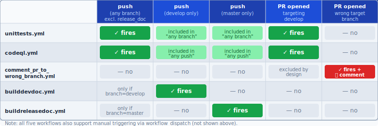
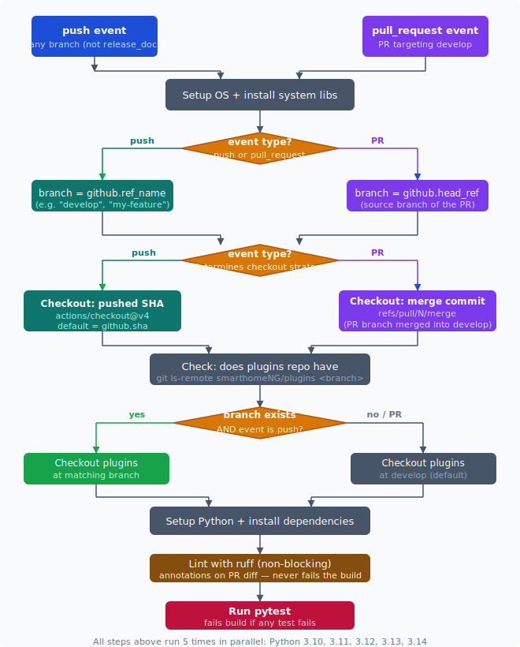

# GitHub Actions Workflows

This document explains all CI/CD automation in `.github/workflows/`. It is written for
someone comfortable with Python and basic GitHub usage (pushing, branching, opening PRs)
but who has not previously worked with GitHub Actions.

---

## Background: What are GitHub Actions?

GitHub Actions is GitHub's built-in automation system. You write YAML files in
`.github/workflows/` and GitHub runs them automatically when certain events happen
— a push, a PR being opened, a tag being created, or manually on demand.

Key vocabulary:

| Term | Meaning |
|---|---|
| **workflow** | One `.yml` file; defines what runs and when |
| **trigger** (`on:`) | The event that starts the workflow (push, pull_request, etc.) |
| **job** | A group of steps that run on the same virtual machine |
| **step** | One shell command or one published action |
| **action** (`uses:`) | A pre-packaged step from the GitHub Marketplace (or GitHub itself) |
| **matrix** | A way to run the same job multiple times with different parameters (e.g. Python versions) |
| **context** | Variables GitHub injects, such as `github.ref_name`, `github.actor` |
| **`$GITHUB_OUTPUT`** | A file each step can write to, making values available to later steps |

When a workflow runs it gets a fresh Ubuntu (or other OS) virtual machine. Nothing
persists between runs — every run starts from a clean slate.

---

## When does each workflow run?



All five workflows also support manual triggering from the GitHub UI via the
"Run workflow" button — this is the `workflow_dispatch` entry in each file.

---

## 1. `unittests.yml` — Continuous Integration

**Purpose:** Run the test suite and the linter against every push and every PR targeting
`develop`. This is the primary quality gate for the project.

### Triggers

```yaml
on:
  workflow_dispatch:        # manual trigger from the GitHub UI
  push:
    branches:
      - '*'                 # all branches
      - '!release_doc'      # … except the release_doc branch (docs-only, no code)
  pull_request:
    branches:
      - 'develop'           # only PRs whose target branch is develop
```

A push directly to `develop` (e.g. after a merge) fires this workflow. A PR from
any branch targeting `develop` also fires it. The `release_doc` branch is excluded
because it only contains built HTML and never contains Python code.

### The matrix strategy

```yaml
matrix:
  python-version: ['3.10', '3.11', '3.12', '3.13', '3.14']
```

The job runs **five times in parallel**, once for each Python version. This catches
regressions that only appear on a specific interpreter — for example, Python 3.12
introduced stricter typing rules that can silently change behaviour.

`fail-fast: false` means all five runs complete even if one fails, giving you the
full picture rather than stopping at the first failure.

### Step-by-step walkthrough



#### Step 1 — OS setup

```yaml
- name: Setup OS (Ubuntu)
  run: |
    sudo apt-get update
    sudo apt-get install libudev-dev librrd-dev libpython3-dev
    sudo apt-get install gcc --only-upgrade
```

Installs native system libraries that some Python packages build against when
installed via pip. `libudev-dev` is needed by packages that talk to USB/hardware
devices. `librrd-dev` is for RRD (round-robin database) bindings. Without these,
`pip install` for some SmartHomeNG dependencies would fail with a compiler error.

#### Step 2 — Extract the branch name

```yaml
- name: Get branch name
  id: extract_branch
  run: |
    if [[ "${{ github.event_name }}" == "pull_request" ]]; then
      echo "branch=${{ github.head_ref }}" >>$GITHUB_OUTPUT
    else
      echo "branch=${{ github.ref_name }}" >>$GITHUB_OUTPUT
    fi
```

This produces a single value — the human-readable branch name — that later steps use
to decide which plugins branch to check out.

**Why the conditional?** GitHub provides different context variables depending on the
event type:

- On a **push** to `my-feature`, `github.ref_name` = `my-feature`.
- On a **PR** from `my-feature` into `develop`, `github.ref` points to a synthetic
  merge reference (`refs/pull/42/merge`), not the branch. The actual source branch
  name is in `github.head_ref` instead.

The previous version used a shell `${GITHUB_REF#refs/heads/}` string strip, which
produced `refs/pull/42/merge` for PR events — a value that would never match any
real branch name. The fix uses the correct context variable for each event type.

#### Step 3 — Checkout core

```yaml
- name: Checkout core
  uses: actions/checkout@v4
```

No `repository` or `ref` parameters — the defaults are intentionally used here:

- On a **push**, `actions/checkout` defaults to the commit SHA that was pushed
  (`github.sha`). You get exactly the code you pushed.
- On a **pull_request**, `actions/checkout` defaults to `refs/pull/N/merge` — a
  synthetic commit that GitHub creates by merging the PR branch into the target
  branch (`develop`). This means the tests run on the code exactly as it would look
  **after merging**, not just on the PR branch in isolation. Merge conflicts that
  would break the merged result are caught here rather than discovered after the
  fact.

> **Design decision:** The previous version specified `ref: ${{ github.base_ref }}`,
> which resolves to `develop` during PR events. That checked out the current state of
> `develop` and ignored the PR entirely — every PR was effectively testing whether
> `develop` still passes, not whether the PR's changes are safe. This was a
> pre-existing bug that was fixed in the workflow overhaul.

#### Step 4 — Check for a matching plugins branch

```yaml
- name: Check if branch '...' exists in smarthomeNG/plugins
  id: shng_branch_check
  run: echo "code=$(git ls-remote --exit-code --heads https://github.com/smarthomeNG/plugins <branch> ...)" >>$GITHUB_OUTPUT
```

SmartHomeNG has two companion repositories: `smarthomeNG/smarthome` (this repo) and
`smarthomeNG/plugins`. The tests need both. When a developer is working on a feature
that spans both repos and uses the same branch name in both, the tests should use the
matching branch from plugins, not `develop`.

`git ls-remote` checks the remote without cloning it. The exit code tells us:
- `0` — the branch exists in plugins
- `2` — the branch does not exist in plugins

This result feeds into the two conditional checkout steps that follow.

#### Steps 5a and 5b — Checkout plugins (conditional)

```yaml
- name: Checkout plugins from branch '...' (push on known branch)
  if: github.event_name != 'pull_request' && steps.shng_branch_check.outputs.code == '0'
  # ... checks out the matching branch

- name: Checkout plugins from branch 'develop' (pull request or push on unknown branch)
  if: github.event_name == 'pull_request' || steps.shng_branch_check.outputs.code == '2'
  # ... checks out develop
```

Exactly one of these runs. For PRs, the plugins always come from `develop` because:
- The PR's changes to core are what's being tested, not plugin changes.
- The plugins `develop` branch is always a safe known-good baseline.

For pushes, if a matching branch exists in plugins (e.g. developer pushed to
`my-feature` in both repos), that branch is used. Otherwise `develop` is the fallback.

#### Steps 6–10 — Python environment and dependencies

```yaml
uses: actions/setup-python@v5     # install the Python version from the matrix
pip install setuptools             # needed for some packages that use setup.py
pip install -r tests/requirements.txt
python3 tools/build_requirements.py   # generates requirements/base.txt
pip install -r requirements/base.txt
```

`build_requirements.py` is a SmartHomeNG utility that reads the configuration
and generates the specific `requirements/base.txt` for the current setup. The base
requirements must be installed because some modules import them at runtime even in
tests.

#### Step 11 — Lint with ruff

```yaml
- name: Lint with ruff
  run: |
    pip install "ruff>=0.4.0"
    ruff check . --output-format=github
```

[Ruff](https://docs.astral.sh/ruff/) is a fast Python linter. The `--output-format=github`
flag causes violations to appear as **inline annotations** on the PR's "Files changed"
tab, directly beside the offending line.

This step is a **hard gate**: any ruff violation fails the CI check and blocks merging.
The `plugins/` directory is excluded here via `[tool.ruff] exclude` in `pyproject.toml` —
plugins have their own `pyproject.toml` and are linted by a matching step in the plugins
repository's `unittests.yml`. The linting rules in both `pyproject.toml` files are kept
in sync (see the SYNC NOTE at the top of each file).

#### Step 12 — Run pytest

```yaml
- name: '>>> Run Python Unittests for CORE <<<'
  working-directory: ./tests
  run: pytest
```

Runs all tests in the `tests/` directory. If any test fails the workflow step fails,
which marks the CI check as failed on the PR and blocks merging (if branch protection
is configured on the repository).

---

## 2. `codeql.yml` — Security Analysis

**Purpose:** Scan all Python code for security vulnerabilities and quality issues using
GitHub's [CodeQL](https://codeql.github.com/) static analysis engine.

### Triggers

```yaml
on:
  workflow_dispatch:
  push:              # all branches, all pushes
  pull_request:
    branches:
      - 'develop'    # added: PRs were not previously scanned
```

> **Design decision:** The original workflow had no `pull_request` trigger. Security
> issues introduced by a PR were only caught after the code landed on a branch — by
> which time it had already been merged. Adding the PR trigger means CodeQL scans the
> proposed changes before they are merged.

### The analysis matrix

```yaml
matrix:
  language: ['python']
```

Currently only Python is scanned. CodeQL supports multiple languages and the matrix
pattern would allow adding JavaScript, C, etc. later without restructuring the file.

### Step-by-step walkthrough

#### Step 1 — Extract branch name

Identical logic to `unittests.yml`: `github.head_ref` for PRs, `github.ref_name` for
pushes. Same reasoning applies.

#### Steps 2a and 2b — Checkout smarthome (fork-aware, split by event)

```yaml
- name: Checkout smarthome (push)
  if: github.event_name != 'pull_request'
  uses: actions/checkout@v4
  with:
    repository: ${{ github.repository_owner }}/smarthome
    ref: ${{ steps.extract_branch.outputs.branch }}
    path: smarthomeng

- name: Checkout smarthome (pull request)
  if: github.event_name == 'pull_request'
  uses: actions/checkout@v4
  with:
    repository: ${{ github.event.pull_request.head.repo.full_name }}
    ref: ${{ github.event.pull_request.head.sha }}
    path: smarthomeng
```

CodeQL checks out into a subdirectory (`path: smarthomeng`) rather than the working
root. This is because the CodeQL configuration also needs the plugins tree alongside
the core, and having them as siblings under a common directory makes path configuration
simpler.

**Why two separate steps instead of one?** The checkout strategy has to differ
fundamentally between push and PR events:

- **Push:** `repository_owner/smarthome` at the pushed branch. Using
  `github.repository_owner` instead of the hardcoded string `smarthomeNG/smarthome`
  means forks scan their own code rather than always scanning upstream.
- **PR:** `github.event.pull_request.head.repo.full_name` is the exact repository the
  PR originated from (which may be a fork), at `github.event.pull_request.head.sha`
  — the exact commit the contributor pushed. This correctly handles PRs from forks
  without needing to know the fork owner's name in advance.

> **Design decision:** The original version hardcoded `smarthomeNG/smarthome` and used
> the broken branch extraction, so the CodeQL scan for PRs was effectively scanning
> the wrong commit. The fix makes it fork-aware and correctly tracks the PR commit.

#### Steps 3a and 3b — Checkout plugins (same conditional logic as unittests)

Identical pattern to `unittests.yml`: use a matching branch if it exists and if the
event is a push; otherwise use `develop`.

#### Step 4 — Initialize CodeQL

```yaml
- name: Initialize CodeQL
  uses: github/codeql-action/init@v3
  with:
    languages: python
    queries: security-and-quality
    config: |
      paths-ignore:
        - '**/executor/examples/**'
```

`security-and-quality` is a combined query suite that checks for both:
- Security issues: SQL injection, path traversal, unsanitised inputs, etc.
- Quality issues: dead code, unreachable blocks, type errors.

The `paths-ignore` configuration skips the executor examples directory, which
contains demonstration code that intentionally uses patterns that would otherwise
trigger false positives.

> **Design decision:** The original file included an `Autobuild` step
> (`github/codeql-action/autobuild@v3`). For compiled languages (C, Java) this step
> builds the project so CodeQL can trace data flow through compiled artefacts. For
> Python, there is nothing to build — CodeQL analyses the source files directly.
> The Autobuild step was therefore removed as a no-op.

#### Step 5 — Perform CodeQL Analysis

```yaml
- name: Perform CodeQL Analysis
  uses: github/codeql-action/analyze@v3
```

Runs the queries against the checked-out code. Results appear in the repository's
**Security → Code scanning** tab. For PRs, findings also appear as inline annotations
on the diff. CodeQL findings do not block merging by default; the security team reviews
them separately.

---

## 3. `comment_pr_to_wrong_branch.yml` — Branch Guard

**Purpose:** When a contributor opens a PR against a branch other than `develop` or
`develop-adminui`, automatically post a comment explaining where PRs should go.

### Triggers

```yaml
on:
  pull_request:
    types: [opened]
    branches:
      - '*'
      - '!develop'
      - '!develop-adminui'
```

`types: [opened]` means the workflow runs only when a PR is first created, not on
every subsequent push to the PR branch. The branch pattern uses negation: match all
target branches (`*`) except the two valid ones. If someone targets `master`, a
release branch, or accidentally targets their own branch, this fires.

> **Design decision:** The two valid target branches are `develop` and
> `develop-adminui`. The second is explicitly whitelisted because it was the active
> development branch for the admin UI before that work was merged into `develop`.
> Keeping both in the exclusion list is intentional.

### The comment step

```yaml
- name: Comment PR
  uses: actions/github-script@v7
  with:
    script: |
      const comment = await github.rest.issues.createComment({ ... });
      await github.rest.reactions.createForIssueComment({ ..., content: '-1' });
```

`actions/github-script` is GitHub's own first-party action for running JavaScript
that uses the GitHub API. It has the authentication token and the Octokit API client
pre-wired, so no credentials need to be specified manually.

The script does two things:
1. Posts a comment on the PR saying where PRs should go.
2. Adds a 👎 reaction to that comment (the `-1` reaction code).

**Why replace the previous action?** The original step used
`thollander/actions-comment-pull-request@v2`, a third-party JavaScript action pinned
only to a major version tag. A major version tag can be moved by its maintainer to
point to new (potentially malicious) code at any time — this is called a supply-chain
attack. SHA pinning (`@abc123def...`) would make the reference immutable, but the
action would still live in an external repo.

`actions/github-script@v7` is maintained by GitHub's own Actions team and achieves
the same effect in ~10 lines of inline JavaScript, eliminating the external dependency
entirely.

---

## 4. `builddevdoc.yml` — Development Documentation

**Purpose:** Build the Sphinx documentation from the `develop` branch and publish it
to the `gh-pages` branch of the separate `smarthomeNG/dev_doc` repository.

### Triggers

```yaml
on:
  workflow_dispatch:
  push:
    branches:
      - 'develop'
```

Only fires on direct pushes to `develop` (which includes merges). PRs do not trigger
it — documentation is only rebuilt from finished, merged code.

### Why three repository checkouts?

```yaml
- uses: actions/checkout@v4                    # this workflow's own repo (not used directly)

- name: Checkout SmartHomeNG DEVELOP Branch
  uses: actions/checkout@v4
  with:
    repository: smarthomeNG/smarthome
    ref: develop
    path: smarthomeng                           # core at ./smarthomeng/

- name: Checkout SmartHomeNG/plugins DEVELOP Branch
  uses: actions/checkout@v4
  with:
    repository: smarthomeNG/plugins
    ref: develop
    path: smarthomeng/plugins                  # plugins nested inside core
```

The Sphinx documentation build (`build_doc_local.sh`) imports the SmartHomeNG modules
to generate API documentation. This means Python must be able to import the code, and
the plugins must be present at the path SmartHomeNG expects them (`plugins/` relative
to the core directory).

The bare `uses: actions/checkout@v4` at the top checks out the current repo (where
the workflow file lives), though the actual build uses the `smarthomeng/` checkout.

### Build and deploy

```yaml
- name: Build documentation
  working-directory: ./smarthomeng/doc
  run: bash ./build_doc_local.sh

- name: Deploy documentation to seperate repo dev_doc
  uses: JamesIves/github-pages-deploy-action@v4.3.3
  with:
    branch: gh-pages
    folder: ./smarthomeng/doc/user/build/html
    repository-name: 'smarthomeNG/dev_doc'
    token: ${{ secrets.PAT_TOKEN }}
```

`build_doc_local.sh` runs Sphinx, which reads docstrings and RST source files and
produces static HTML. The resulting `html/` folder is then pushed to the `gh-pages`
branch of `smarthomeNG/dev_doc`.

Publishing to a **separate repository** (rather than the current repo's `gh-pages`
branch) requires a Personal Access Token (`PAT_TOKEN`) with write access to that repo.
A standard `GITHUB_TOKEN` only has permissions within the current repository.

> **Action version note:** The original file used `actions/checkout@v2` and
> `actions/setup-python@v2`. These versions use Node 16, which GitHub deprecated and
> will eventually remove from runners. Updated to `@v4`/`@v5` (Node 20).

---

## 5. `buildreleasedoc.yml` — Release Documentation

**Purpose:** Same as `builddevdoc.yml` but runs from the `master` branch and deploys to
a `release_doc` branch in the **same** repository (not a separate one).

### Key differences from builddevdoc.yml

| | `builddevdoc.yml` | `buildreleasedoc.yml` |
|---|---|---|
| Trigger branch | `develop` | `master` |
| Source branches | `develop` for both repos | `master` for both repos |
| Deploy target | `smarthomeNG/dev_doc` (separate repo) | `release_doc` branch (same repo) |
| Authentication | `PAT_TOKEN` secret required | standard `GITHUB_TOKEN` (implicit) |

Publishing to a branch within the same repo does not require a PAT because the
workflow's automatically-provided `GITHUB_TOKEN` already has write access to the repo
it is running in.

```yaml
- run: pip install attrs  # install separately until requirements in master branch are updated
```

This line exists because the `master` branch's requirements files are behind the
`develop` branch in one dependency. It's a temporary shim noted in the original file
and should be removed once `master` requirements are updated to include `attrs`.

---

## Maintenance notes

### Progressing to ruff Phase 2 (bugbear rules)

Ruff is currently configured with `select = ["E", "F"]` (pycodestyle + pyflakes).
The next phase adds `B` (flake8-bugbear — catches real bugs like mutable default
arguments and bare `except`):

1. Edit `pyproject.toml` in the shng root: change `select = ["E", "F"]` to `select = ["E", "F", "B"]`.
2. Mirror the change in `plugins/pyproject.toml` (see SYNC NOTE in both files).
3. Run `ruff check . --select B` locally to review the new violations before committing.
4. Fix or suppress violations, then commit both `pyproject.toml` files.

### Adding a new Python version to the test matrix

Edit the `matrix.python-version` list in `unittests.yml`. The matrix automatically
creates a new parallel job with no other changes needed.

### Checking action version currency

- `actions/checkout` — check [releases](https://github.com/actions/checkout/releases)
- `actions/setup-python` — check [releases](https://github.com/actions/setup-python/releases)
- `actions/github-script` — check [releases](https://github.com/actions/github-script/releases)
- `github/codeql-action` — check [releases](https://github.com/github/codeql-action/releases)
- `JamesIves/github-pages-deploy-action` — check [releases](https://github.com/JamesIves/github-pages-deploy-action/releases)

All GitHub-owned actions (`actions/*`) are safe to track by major version tag
(e.g. `@v4`). Third-party actions should ideally be pinned to a specific commit SHA.
`JamesIves/github-pages-deploy-action@v4.3.3` is pinned to a specific minor/patch
version, which is a reasonable middle ground.
