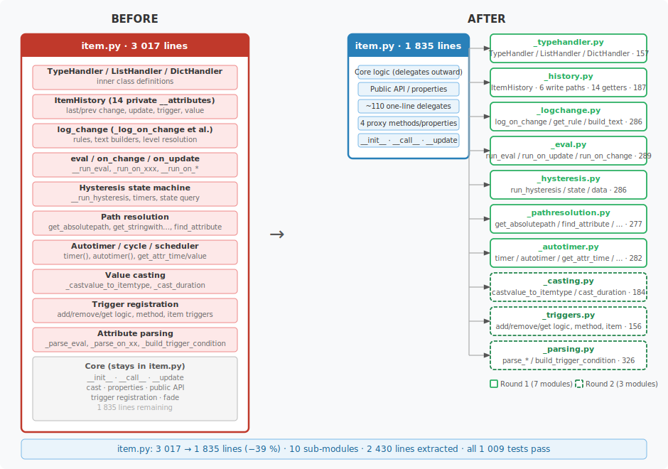
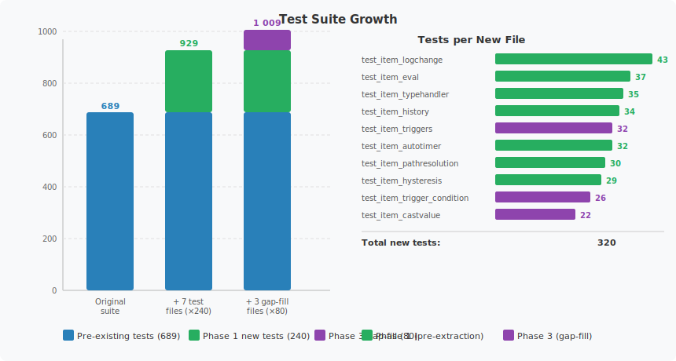
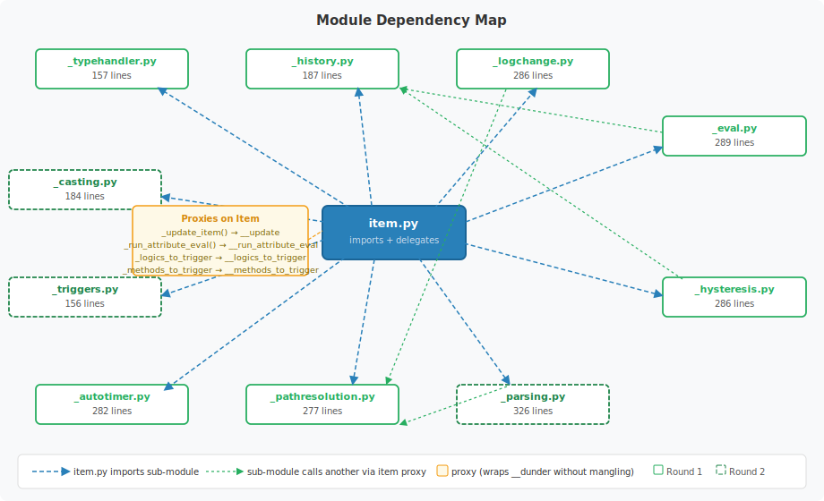
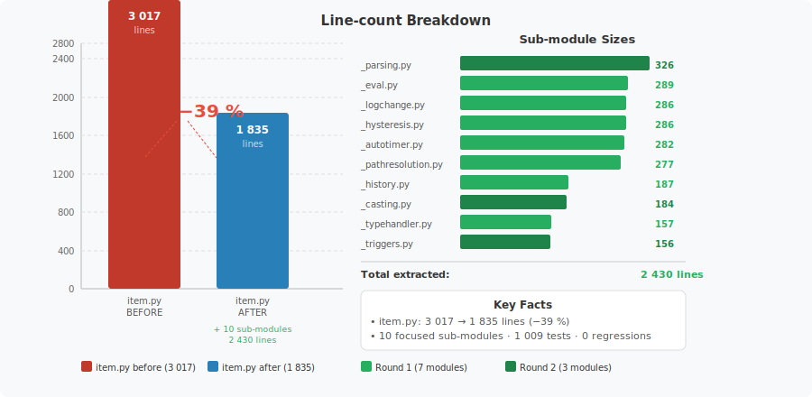

# `lib/item` — Test Coverage & Refactoring

A record of the test-coverage and modularisation work carried out on
`lib/item/item.py` (SmartHomeNG's central Item class).

---

## Overview

`lib/item/item.py` began as a **3 017-line monolith** containing every concern
of the SmartHomeNG Item object: type handling, history tracking, eval
expressions, log-change rules, hysteresis state machine, autotimer/cycle
scheduler wiring, path resolution, attribute parsing, value casting,
trigger registration, and more.

The work proceeded in three phases:

1. **Safety net** — write comprehensive unit tests before touching anything.
2. **Extraction round 1** — pull seven concerns into focused sub-modules.
3. **Extraction round 2** — three further sub-modules; `item.py` down to −39 %.

---

## Result at a Glance

| Metric | Before | After |
|---|---:|---:|
| `item.py` lines | 3 017 | 1 835 |
| Lines removed from `item.py` | — | −1 182 (−39 %) |
| Sub-modules created | 0 | 10 |
| Total sub-module lines | 0 | 2 430 |
| New test files | 0 | 10 |
| New tests | 0 | 320 |
| Full test-suite size | 689 | 1 009 |
| Test-suite result | — | **1 009 passed** |



---

## Phase 1 — Safety Net (10 test files, 320 tests)

Tests were written **before** any production code was changed so that every
extraction could be validated immediately.

### Pre-extraction tests (7 files, 240 tests)

| Test file | Tests | Covers |
|---|---:|---|
| `test_item_typehandler.py` | 35 | `TypeHandler`, `ListHandler`, `DictHandler`, `HANDLER_MAP` |
| `test_item_history.py` | 34 | `ItemHistory` — all 6 write paths and 14 getters |
| `test_item_pathresolution.py` | 30 | `get_absolutepath`, `get_stringwithabsolutepathes`, `find_attribute`, `expand_relativepathes` |
| `test_item_autotimer.py` | 32 | `_parse_cycle_attribute`, `_init_start_scheduler`, `timer`, `autotimer`, `remove_timer`, `_cast_duration` |
| `test_item_eval.py` | 37 | `_parse_eval_attribute`, `_parse_on_xx_list_attribute`, `__run_eval`, on_change/on_update execution |
| `test_item_hysteresis.py` | 29 | Hysteresis config parsing, `hysteresis_state`, `hysteresis_data`, helper methods |
| `test_item_logchange.py` | 43 | `_log_on_change`, `_get_rule`, `_log_build_standardtext`, `_log_build_text`, all filter/limit rules |

### Post-extraction gap-fill tests (3 files, 80 tests)

Added after analysis revealed gaps in coverage for the next set of extraction
candidates.

| Test file | Tests | Covers |
|---|---:|---|
| `test_item_castvalue.py` | 22 | `_castvalue_to_itemtype` — all item types, compat modes, failure/fallback paths |
| `test_item_triggers.py` | 32 | `add/remove/get_logic_triggers`, `add/remove/get_method_triggers`, `get_item_triggers`, `get_hysteresis_item_triggers` |
| `test_item_trigger_condition.py` | 26 | `_build_trigger_condition_eval` — `=`→`==` rewrite, true/False normalisation, AND/OR joining, relative path expansion |



---

## Phase 2 — Modular Extraction Round 1 (7 sub-modules, −34 %)

Each extraction followed the same pattern:

1. Write the module-level function(s) accessing only `_single_underscore`
   attributes and public methods on `Item` (avoiding Python name-mangling).
2. Add thin proxy methods to `Item` where private (`__dunder`) attributes must
   still be reached.
3. Replace the original method body in `item.py` with a one-line delegate.
4. Run the full test suite — all green before proceeding.



### `_typehandler.py` — 157 lines

**Extracted from:** inner-class definitions inside `Item`.

| Symbol | Role |
|---|---|
| `TypeHandler` | Base class — validates item type on construction |
| `ListHandler` | Proxy for all list mutation methods (`append`, `prepend`, `insert`, `pop`, `extend`, `clear`, `delete`, `remove`) |
| `DictHandler` | Proxy for all dict mutation methods (`get`, `delete`, `clear`, `pop`, `popitem`, `update`) |
| `HANDLER_MAP` | `{'list': ListHandler, 'dict': DictHandler}` — used in `Item.__init__` |

Every mutating method routes through `item.__call__()` so the full item-update
pipeline (history, on_change, autotimer, log_change) fires on every mutation.

---

### `_history.py` — 187 lines

**Extracted from:** 14 private `__dunder` timestamp/caller attributes scattered
through `Item.__init__` and `Item._set_value` / `Item.__update` /
`Item.__run_eval`.

`ItemHistory` (using `__slots__`) owns:

| Write method | Called from |
|---|---|
| `record_change(old, caller, source, shtime, ...)` | `_set_value()` on actual value change |
| `record_update_only(caller, source, shtime)` | `__update()` on same-value write |
| `record_trigger(caller, source, shtime)` | `__run_eval()` when eval fires |
| `record_trigger_none(caller, source)` | `__run_eval()` when eval returns None |
| `set_initial_value_caller(caller)` | `__init__` after initial value is set |
| `set_from_cache(cache_time, caller)` | `__init__` after cache restore |

14 getters mirror the old `__private` attribute names so all read-sites in
`item.py` and `property.py` required only trivial one-line changes.

---

### `_logchange.py` — 286 lines

**Extracted from:** `Item._log_on_change`, `Item._get_rule`,
`Item._log_build_standardtext`, `Item._log_build_text`.

| Function | Role |
|---|---|
| `log_on_change(item, value, caller, source, dest)` | Public entry point — checks logger, applies rules, builds text, logs |
| `get_rule(item, rule_entry)` | Retrieves and normalises a single `log_rules` entry (type conversion, item-value lookup) |
| `build_standardtext(item, value, caller, source, dest)` | Default log text when no `log_text` template is set |
| `build_text(item, value, caller, source, dest)` | Evaluates `log_text` as an f-string with 20+ named variables |

Key design choice: `_logchange.py` uses `item.return_parent()` (public) instead
of `item.__parent` (mangled), avoiding all name-mangling issues.

---

### `_eval.py` — 289 lines

**Extracted from:** `Item.__run_eval`, `Item._run_on_xxx`,
`Item.__run_on_update`, `Item.__run_on_change`.

| Function | Role |
|---|---|
| `run_eval(item, value, caller, source, dest)` | Full eval state machine — status checks, trigger condition, expression evaluation, error handling |
| `run_on_xxx(item, path, value, on_dest, on_eval, attr, ...)` | Shared runner for on_update / on_change entries |
| `run_on_update(item, value, caller, source, dest)` | Iterates `_on_update` list → `run_on_xxx` |
| `run_on_change(item, value, caller, source, dest)` | Iterates `_on_change` list → `run_on_xxx` |

Proxy added to `Item`:

```python
def _update_item(self, value, caller='Logic', source=None, dest=None, ...):
    """Public proxy for __update — used by extracted submodules."""
    self.__update(value, caller, source, dest, key, index)
```

`run_on_xxx` calls `dest_item._update_item(...)` rather than the mangled
`dest_item._Item__update(...)`.  The `Item.__run_eval` method is kept as a
one-line delegate so the scheduler can still receive `item.__run_eval` as a
callable without change.

---

### `_hysteresis.py` — 286 lines

**Extracted from:** `Item.__run_hysteresis`, `Item.hysteresis_state`,
`Item.hysteresis_data`, `Item._onoff`, `Item._get_hysterisis_state_string`.

| Function | Role |
|---|---|
| `run_hysteresis(item, value, caller, source, dest)` | Full state machine: threshold comparison, timer arming/cancellation, `_update_item` calls |
| `get_hysteresis_state(item)` | Human-readable state string query |
| `get_hysteresis_data(item)` | Diagnostic dict with all thresholds, timers, input/output, state |
| `_get_hysteresis_state_string(item, lower, upper, input, ...)` | Internal helper — On/Off/Stay/Cached/Timer classification |
| `_onoff(value)` | Pure helper — `True → 'On'`, `False → 'Off'` |

Proxy added:

```python
def _run_attribute_eval(self, expr, result_type='num', result_error=''):
    return self.__run_attribute_eval(expr, result_type, result_error)
```

---

### `_pathresolution.py` — 277 lines

**Extracted from:** `Item.get_absolutepath`, `Item.get_stringwithabsolutepathes`,
`Item.find_attribute`, `Item._split_destitem_from_value`,
`Item.expand_relativepathes`.

| Function | Role |
|---|---|
| `get_absolutepath(item, relativepath, attr)` | Resolves `.relative` and `..parent` dotted paths against the item's own path |
| `get_stringwithabsolutepathes(item, evalstr, begintag, endtag, attr)` | Finds all `begintag.relative.path` sequences in a string and expands them |
| `find_attribute(item, attr, default, level, strict)` | Walks the item tree upward looking for an attribute |
| `split_destitem_from_value(value)` | Parses `dest = expr` syntax from on_change/on_update attributes (pure string — no item needed) |
| `expand_relativepathes(item, attr, begintag, endtag)` | Mutates `item.conf[attr]` in-place, resolving all relative references |

These five functions have no name-mangling issues — they only use
`item._path`, `item.conf`, `item._is_top_of_item_tree()` (public), and
`item.return_parent()` (public).

---

### `_autotimer.py` — 282 lines

**Extracted from:** `Item._init_start_scheduler`, `Item.__get_items_from_string`,
`Item.get_attr_time`, `Item.get_attr_value`, `Item.timer`, `Item.remove_timer`,
`Item.autotimer`.

| Function | Role |
|---|---|
| `get_attr_time(item, attr)` | Resolves `_cycle_time` / `_autotimer_time` — handles int literals, duration strings, and eval expressions |
| `get_attr_value(item, attr, value)` | Resolves `_cycle_value` / `_autotimer_value` — eval expressions supported |
| `get_items_from_string(item, string)` | Regex-extracts all `sh.path.to.item()` references from an expression string |
| `init_start_scheduler(item)` | Registers the crontab / cycle scheduler entry for the item |
| `item_timer(item, time, value, ...)` | Starts a one-shot or auto timer via `scheduler.add` |
| `item_remove_timer(item)` | Cancels the running timer via `scheduler.remove` |
| `item_autotimer(item, time, value)` | Sets or clears `_autotimer_time` / `_autotimer_value` |

---

## Phase 3 — Modular Extraction Round 2 (3 sub-modules, −39 % total)

Three further sub-modules extracted after the gap-fill tests were in place.

### `_casting.py` — 184 lines

**Extracted from:** `Item._castvalue_to_itemtype`, `Item._cast_duration`.

| Function | Role |
|---|---|
| `castvalue_to_itemtype(item, value, compat)` | Casts value to the item's declared type; logs and falls back on failure |
| `cast_duration(item, time, test)` | Converts human-readable duration strings (`'5m'`, `'2h30s'`, …) to seconds |

Key design choice: the original code used `globals()['cast_' + self._type]` to
look up the cast function by name.  The extracted version uses an explicit
`_CAST_MAP` dict populated from direct imports — independent of another
module's global namespace and immediately readable.

---

### `_triggers.py` — 156 lines

**Extracted from:** `Item.add_logic_trigger`, `Item.remove_logic_trigger`,
`Item.get_logic_triggers`, `Item.add_method_trigger`,
`Item.remove_method_trigger`, `Item.get_method_triggers`,
`Item.get_item_triggers`, `Item.get_hysteresis_item_triggers`.

| Function | Role |
|---|---|
| `add/remove/get_logic_triggers(item, ...)` | Manage the list of logics triggered on item change |
| `add/remove/get_method_triggers(item, ...)` | Manage the list of plugin-method callbacks |
| `get_item_triggers(item)` | Return items whose eval is re-run when this item changes |
| `get_hysteresis_item_triggers(item)` | Return items whose hysteresis eval is re-run |

Name-mangling note: `__logics_to_trigger` and `__methods_to_trigger` are
double-underscore attributes.  Two `@property` proxies were added to `Item`:

```python
@property
def _logics_to_trigger(self):
    return self.__logics_to_trigger

@property
def _methods_to_trigger(self):
    return self.__methods_to_trigger
```

Both return the *same* list object so in-place mutations from `_triggers.py`
are immediately visible inside the class.

---

### `_parsing.py` — 326 lines

**Extracted from:** `Item._parse_eval_attribute`,
`Item._parse_eval_trigger_list_attribute`,
`Item._parse_hysteresis_input_attribute`,
`Item._parse_hysteresis_xx_threshold_attribute`,
`Item._parse_on_xx_list_attribute`, `Item._parse_cycle_attribute`,
`Item._parse_autotimer_attribute`, `Item._build_trigger_condition_eval`.

| Function | Role |
|---|---|
| `parse_eval_attribute(item, attr, value)` | Stores eval expression; expands relative `sh.` paths |
| `parse_eval_trigger_list_attribute(item, attr, value)` | Wraps bare string in list; expands each trigger path |
| `parse_hysteresis_input_attribute(item, attr, value)` | Expands relative hysteresis input path |
| `parse_hysteresis_xx_threshold_attribute(item, attr, value)` | Splits optional timer; expands both threshold and timer expressions |
| `parse_on_xx_list_attribute(item, attr, value)` | Parses `dest = expr` syntax; expands paths in both dest and expr |
| `parse_cycle_attribute(item, attr, value, compat_default)` | Splits duration/value string; expands `sh.` refs |
| `parse_autotimer_attribute(item, attr, value, compat_default)` | Same pattern as cycle |
| `build_trigger_condition_eval(item, trigger_condition)` | Builds a Python boolean expression from the condition dict list |

`ATTRIB_COMPAT_DEFAULT` is a mutable module-level global in `item.py` that is
initialised during `__init__`.  Importing it from `item.py` in `_parsing.py`
would be circular, so it is forwarded as a parameter through the delegate:

```python
def _parse_cycle_attribute(self, attr, value):
    _parse_cycle_attribute(self, attr, value, ATTRIB_COMPAT_DEFAULT)
```

---

## Line-count Reduction



```
item.py  ████████████████████████████████░░░░░░░░░░░░░░░░░░  3017 → 1835  (−1182, −39 %)

Moved into sub-modules:
  _typehandler    ██░  157 lines
  _history        ██░  187 lines
  _logchange      ███  286 lines
  _eval           ███  289 lines
  _hysteresis     ███  286 lines
  _pathresolution ███  277 lines
  _autotimer      ███  282 lines
  _casting        ██░  184 lines
  _triggers       ██░  156 lines
  _parsing        ████ 326 lines
                       ─────────
                       2 430 lines in sub-modules
```

---

## Key Design Principles

### No name-mangling outside the class

Python mangles `__dunder` names inside a class body:
`self.__update` → `self._Item__update`.
Code outside the class body cannot use the short form.

All extracted functions use only:
- Single-underscore attributes (`item._value`, `item._path`, …)
- Public methods (`item.return_parent()`, `item._is_top_of_item_tree()`, …)
- Explicit proxy methods/properties added to `Item` for the handful of private
  members that had to remain private:
  - `_update_item()` → `__update()`
  - `_run_attribute_eval()` → `__run_attribute_eval()`
  - `_logics_to_trigger` property → `__logics_to_trigger` list
  - `_methods_to_trigger` property → `__methods_to_trigger` list

### Thin delegate pattern

Every original `Item` method is kept as a one-line delegate so:
- The public API is unchanged
- Scheduler callbacks (`obj=item.__run_eval`) continue to work
- Name-mangled access from within the class still works

```python
# item.py — before
def __run_eval(self, value=None, caller='Eval', source=None, dest=None):
    if caller.lower().startswith('admin:'):
        ...  # 90 lines of logic

# item.py — after
def __run_eval(self, value=None, caller='Eval', source=None, dest=None):
    run_eval(self, value=value, caller=caller, source=source, dest=dest)
```

### Test-first, extract-second

Every sub-module extraction was preceded by a full green test run.
The suite was re-run immediately after each extraction.
No extraction phase introduced a single test regression.

---

## Files Changed / Created

### New source files

| File | Lines | Description |
|---|---:|---|
| `lib/item/_typehandler.py` | 157 | List/dict handler proxy classes |
| `lib/item/_history.py` | 187 | `ItemHistory` — timestamp & caller tracking |
| `lib/item/_logchange.py` | 286 | log_change rules, text builders |
| `lib/item/_eval.py` | 289 | eval / on_change / on_update runners |
| `lib/item/_hysteresis.py` | 286 | Hysteresis state machine |
| `lib/item/_pathresolution.py` | 277 | Path resolution helpers |
| `lib/item/_autotimer.py` | 282 | Autotimer / cycle / scheduler helpers |
| `lib/item/_casting.py` | 184 | `castvalue_to_itemtype`, `cast_duration` |
| `lib/item/_triggers.py` | 156 | Trigger registration / query |
| `lib/item/_parsing.py` | 326 | Attribute parsers + trigger condition builder |

### New test files

| File | Tests | Description |
|---|---:|---|
| `tests/test_item_typehandler.py` | 35 | TypeHandler / ListHandler / DictHandler |
| `tests/test_item_history.py` | 34 | ItemHistory write/read paths |
| `tests/test_item_pathresolution.py` | 30 | Path resolution functions |
| `tests/test_item_autotimer.py` | 32 | Autotimer/cycle/timer API |
| `tests/test_item_eval.py` | 37 | Eval config parsing and execution |
| `tests/test_item_hysteresis.py` | 29 | Hysteresis state machine |
| `tests/test_item_logchange.py` | 43 | log_change rules and text builders |
| `tests/test_item_castvalue.py` | 22 | `_castvalue_to_itemtype` all types |
| `tests/test_item_triggers.py` | 32 | Trigger registration / firing |
| `tests/test_item_trigger_condition.py` | 26 | `_build_trigger_condition_eval` |

### Modified files

| File | Change |
|---|---|
| `lib/item/item.py` | −1 182 lines; 10 import blocks added; ~110 method bodies replaced with one-line delegates; 4 public proxies added (2 methods + 2 properties) |
| `tests/test_item_logchange.py` | Updated to call `log_on_change(item, …)` etc. instead of `item._log_on_change(…)` |
| `tests/test_item_hysteresis.py` | Updated to call `_onoff(v)` and `_get_hysteresis_state_string(item, …)` from the module |
